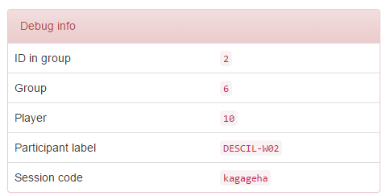

Admin
=====

oTree comes with an admin interface, so that experimenters can manage
sessions, monitor the progress of live sessions, and export data after
sessions.

Open your browser to the root url of your web application. If you're
developing locally, this will be *http://127.0.0.1:8000/*.

.. _AUTH_LEVEL:

Password protection
-------------------

When you first install oTree, The entire admin interface is accessible
without a password. However, when you are ready to launch your oTree
app, you should password protect the admin so that visitors and
participants cannot access sensitive data.

If you are launching an experiment and want visitors to only be able to
play your app if you provided them with a start link, set the
environment variable ``OTREE_AUTH_LEVEL`` to ``STUDY``.

If you would like to put your site online in public demo mode where
anybody can play a demo version of your game, set ``OTREE_AUTH_LEVEL``
to ``DEMO``. This will allow people to play in demo mode, but not access
the full admin interface.

If you don't want any password protection at all, just leave this variable
blank.

.. _edit_session_config:

Configure sessions
------------------

.. note::

    This feature is only available in the latest otree-core (Oct 2016).

You can make your session configurable,
so that you can adjust the game's parameters in the admin interface,
without needing to edit the source code.

For example, let's say you are making a public goods game,
whose payoff function depends on
an "efficiency factor" parameter that is a numeric constant,
like 1.5 or 2. The usual approach would be to define it in ``Constants``,
e.g. ``Constants.efficiency_factor``

To make this parameter configurable, move it from ``Constants``
to your config in :ref:`SESSION_CONFIGS`. For example:

.. code-block:: python

    {
        'name': 'my_session_config',
        'display_name': 'My Session Config',
        'num_demo_participants': 2,
        'app_sequence': ['my_app_1', 'my_app_2'],
        'efficiency_factor': 1.5,
    },

Then, when you create a session in the admin interface
and select this session config, the ``efficiency_factor`` parameter will
be listed, and you can change it to a number other than 1.5.
If you want to explain the meaning of the variable to the user,
you can add a ``'doc'`` parameter to the session config dict, e.g.:

.. code-block:: python

    {
        'name': 'my_session_config',
        'display_name': 'My Session Config',
        'num_demo_participants': 2,
        'app_sequence': ['my_app_1', 'my_app_2'],
        'efficiency_factor': 1.5,
        'doc': """
        Edit the 'efficiency_factor' parameter to change the factor by which
        contributions to the group are multiplied.
        """
    },

Then in your app's code, you can do ``self.session.config['efficiency_factor`]``
to retrieve the current session's efficiency factor.

Notes:
-   For a field to be configurable, its value must be a simple data type
    (number, boolean, or string).
-   On the "Demo" section of the admin, sessions are not configurable.
    It's only available when creating a session in "Sessions" or "Rooms".

Also see :ref:`session_config_treatments`.

Start links
-----------

There are multiple types of start links you can use.
The optimal one depends on how you are distributing the links to your users.

.. _single_use_links:

Single-use links
~~~~~~~~~~~~~~~~

When you create a session, oTree creates 1 start link per participant,
each of which contains a unique code for the participant.

Session-wide link
~~~~~~~~~~~~~~~~~

If it is impractical to distribute distinct URLs to each participant,
you can provide the same start link to all participants in the session.
Note: this may result in the same participant playing twice, unless you use the
``participant_label`` parameter in the URL (see :ref:`participant_label`).

Server-wide (persistent) link
~~~~~~~~~~~~~~~~~~~~~~~~~~~~~

You can create persistent links that will stay constant for new sessions, even if the database is recreated.

This is useful in the following situations:

* You are running multiple lab sessions, and cannot easily distribute new links to the workstations each time you create a session.
* You are running multiple sessions online with the same group of participants, and want each participant to use the same link each time they participate in one of your sessions.

See :ref:`rooms`.

.. _participant_label:

Participant labels
------------------

You can append a ``participant_label`` parameter to each participant's start
URL to identify them, e.g. by name, ID number, or computer workstation.

Each time a start URL is accessed, oTree checks for the presence of a
``participant_label`` parameter and records it for that participant. This
label will be displayed in places where participants are listed, like the
oTree admin interface or the payments page.
You can also access it from your code as ``participant.label``.

.. _randomization:

Randomization
-------------

If participants are not using single-use links (see :ref:`single_use_links`),
oTree will assign the first person who arrives to be P1, the second to be P2, etc.
If you would instead like participant selection to be random, you can set ``'random_start_order': True,``
in the session config dictionary (or ``SESSION_CONFIG_DEFAULTS``).

Note that if you use single-use links, then ``random_start_order`` will have no effect, because each
single-use link is tied to a specific participant (the URL contains the participant's unique code).

Online experiments
------------------

Experiments can be launched to participants playing over the internet,
in a similar way to how experiments are launched the lab. Login to the
admin, create a session, then distribute the links to participants via
email or a website.

Kiosk Mode
----------

On your lab's devices, you can enable "kiosk mode", a setting available in
most web browsers, to prevent participants from doing things like accessing
the browser's address bar, hitting the "back" button, or closing the browser
window.

Below are some guidelines on how to enable Kiosk mode.

iOS (iPhone/iPad)
~~~~~~~~~~~~~~~~~

1. Go to Setting – Accessibility – Guided Access
2. Turn on Guided Access and set a passcode for your Kiosk mode
3. Open your web browser and enter your URL
4. Triple-click home button to initiate Kiosk mode
5. Circle areas on the screen to disable (e.g. URL bar) and activate

Android
~~~~~~~

There are several apps for using Kiosk mode on Android, for instance:
`Kiosk Browser
Lockdown <https://play.google.com/store/apps/details?id=com.procoit.kioskbrowser&hl=en>`__.

.. image:: _static/admin/android.png
    :align: center
    :scale: 100 %

oTree comes with an admin interface, so that experimenters can manage
sessions, monitor the progress of live sessions, and export data after
sessions.

Open your browser to the root url of your web application. If you're
developing locally, this will be http://127.0.0.1:8000/.

Chrome on PC
~~~~~~~~~~~~

1. Go to Setting – Users – Add new user
2. Create a new user with a desktop shortcut
3. Right-click the shortcut and select “Properties”
4. In the “Target” filed, add to the end either
   ``--kiosk "http://www.your-otree-server.com"`` or
   ``--chrome-frame  --kiosk "http://www.your-otree-server.com"``
5. Disable hotkeys (see
   `here <http://superuser.com/questions/727072/what-windows-shortcuts-should-be-blocked-on-a-kiosk-mode-pc>`__)
6. Open the shortcut to activate Kiosk mode

IE on PC
~~~~~~~~

IE on PC See `here <http://support2.microsoft.com/kb/154780>`__

Mac
~~~

There are several apps for using Kiosk mode on Mac, for instance:
`eCrisper <http://ecrisper.com/>`__. Mac keyboard shortcuts should be
disabled.

Monitor sessions
----------------

While your session is ongoing, you can monitor the live progress in the
admin interface. The admin tables update live, highlighting changes as
they occur.

Payments page
-------------

At the end of your session, you can open and print a page that lists all
the participants and how much they should be paid.

.. figure:: _static/admin/nSMlWcY.png
   :alt:

Export Data
-----------

You can download your raw data in text format (CSV) so that you can view
and analyze it with a program like Excel, Stata, or R.

Autogenerated documentation
---------------------------

Each model field you define can also have a ``doc=`` argument. Any
string you add here will be included in the autogenerated documentation
file, which can be downloaded through the data export page in the admin.

Debug Info
----------

When oTree runs in ``DEBUG`` mode (i.e. when the environment variable
``OTREE_PRODUCTION`` is not set), debug information is displayed
on the bottom of all screens. The debug information consists of the ID
in group, the group, the player, the participant label, and the session
code. The session code and participant label are two randomly generated
alphanumeric codes uniquely identifying the session and participant. The
ID in group identifes the role of the player (e.g., in a principal-agent
game, principals might have the ID in group 1, while agents have 2).

