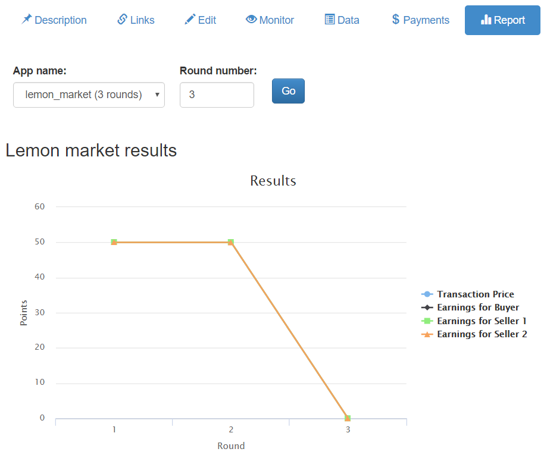
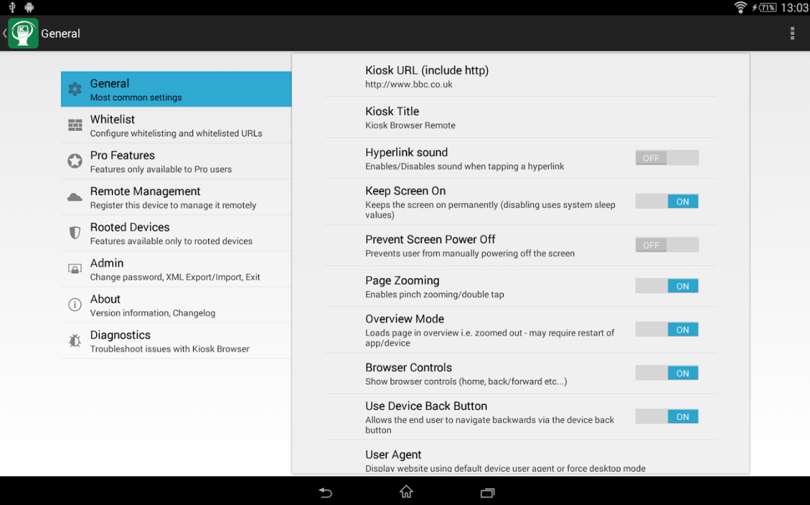
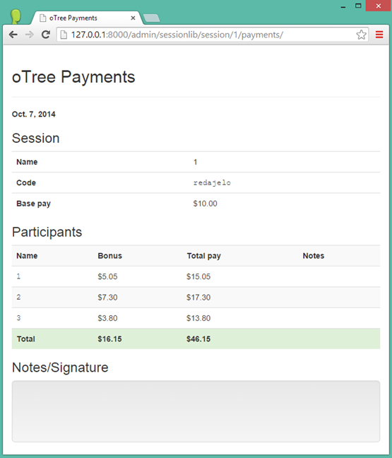

Admin
=====

oTree's admin interface lets you create, monitor,
and export data from sessions.

Open your browser to the root url of your web application. If you're
developing locally, this will be *http://127.0.0.1:8000/*.

.. _AUTH_LEVEL:

Password protection
-------------------

When you first install oTree, The entire admin interface is accessible
without a password. However, when you are ready to deploy to your audience,
you should password protect the admin.

If you are launching an experiment and want visitors to only be able to
play your app if you provided them with a start link, set the
environment variable ``OTREE_AUTH_LEVEL`` to ``STUDY``.

To put your site online in public demo mode where
anybody can play a demo version of your game
(but not access the full admin interface), set ``OTREE_AUTH_LEVEL``
to ``DEMO``.

If you don't want any password protection at all,
leave this variable unset/blank.

Start links
-----------

There are multiple types of start links you can use.

Rooms
~~~~~

In most cases where you are doing a study, the best
way to set up URLs is to make a :ref:`room <rooms>`.

.. _single_use_links:

Single-use links
~~~~~~~~~~~~~~~~

If a room is not suited for your needs,
you can use oTree's single-use links.
Every time you create a session, you will need to re-distribute URLs
to each participant.

Session-wide link
~~~~~~~~~~~~~~~~~

The session-wide link lets you provide
the same start link to all participants in the session.
Note: this may result in the same participant playing twice, unless you use the
``participant_label`` parameter in the URL (see :ref:`participant_label`).

Before using the session-wide link, consider using a
:ref:`room <rooms>`, because you can also use a room without a
participant label file to allow everyone to play with the same URL.
The advantage of using a room is that the URL is simpler to type
(doesn't contain a randomly generated code),
and you can reuse it across sessions.

.. _participant_label:

Participant labels
------------------

Whether or not you're using a :ref:`room <rooms>`,
you can append a ``participant_label`` parameter to each participant's start
URL to identify them, e.g. by name, ID number, or computer workstation.
For example::

    http://127.0.0.1:8000/room/my_room_name/?participant_label=John

oTree will record this participant label. It
will be used to identify that participant in the
oTree admin interface and the payments page, etc.
You can also access it from your code as ``self.participant.label``.

Arrival order
-------------

(Note: if using single-use links, this section does not apply.)

oTree will assign the first person who arrives to be P1, the second to be P2, etc.

.. _edit_config:

Configure sessions
------------------

You can make your session configurable,
so that you can adjust the game's parameters in the admin interface,
without needing to edit the source code:

.. image:: _static/admin/edit-config.png
    :align: center
    :scale: 100 %

For example, let's say you are making a public goods game,
whose payoff function depends on
an "efficiency factor" parameter that is a numeric constant,
like 1.5 or 2. The usual approach would be to define it in ``Constants``,
e.g. ``Constants.efficiency_factor``

However, to make your custom parameter configurable, instead of adding it to
``Constants``, add it to your config in :ref:`SESSION_CONFIGS`. For example:

.. code-block:: python

    {
        'name': 'my_session_config',
        'display_name': 'My Session Config',
        'num_demo_participants': 2,
        'app_sequence': ['my_app_1', 'my_app_2'],
        'efficiency_factor': 1.5,
    },

Then, when you create a session in the admin interface
and select this session config, the ``efficiency_factor`` parameter will
be listed, and you can change it to a number other than 1.5.
If you want to explain the meaning of the variable to the person creating
the session, you can add a ``'doc'`` parameter to the session config dict, e.g.:

.. code-block:: python

    {
        'name': 'my_session_config',
        'display_name': 'My Session Config',
        'num_demo_participants': 2,
        'app_sequence': ['my_app_1', 'my_app_2'],
        'efficiency_factor': 1.5,
        'doc': """
        Edit the 'efficiency_factor' parameter to change the factor by which
        contributions to the group are multiplied.
        """
    },

Then in your app's code, you can do ``self.session.config['efficiency_factor']``
to retrieve the current session's efficiency factor.

Notes:

-   For a field to be configurable, its value must be a simple data type
    (number, boolean, or string).
-   On the "Demo" section of the admin, sessions are not configurable.
    It's only available when creating a session in "Sessions" or "Rooms".

Also see :ref:`session_config_treatments`.

.. _admin_report:

Customizing the admin interface (admin reports)
-----------------------------------------------

.. note::

    This is a new feature
    in otree-core 1.1 or higher (Dec 2016).

You can add a custom tab to a session's admin page with any content you want;
for example:

-   A chart/graph with the game's results
-   A custom payments page that is different from oTree's built-in one

Here is a screenshot:

To use this feature, you create a template called ``AdminReport.html``,
and optionally, a method ``Subsession.vars_for_admin_report``.

Here is a trivial example, where we add an admin report that
displays a sorted list of payoffs for a given round.

First, define a method ``vars_for_admin_report`` on the Subsession.
This works the same way as :ref:`vars_for_template`.
For example:

.. code-block:: python

    class Subsession(BaseSubsession):
        def vars_for_admin_report(self):
            payoffs = sorted([p.payoff for p in self.get_players()])
            return {'payoffs': payoffs}

Then create a template ``AdminReport.html`` in the same folder as the app's regular
templates, and display whatever variables were passed in ``vars_for_admin_report``:

.. code-block:: html+django

    
Here is the sorted list of payoffs in round {{ subsession.round_number }}

    <ul>
        
            <li>{{ payoff }}</li>
        
    </ul>

Notes:

-   ``subsession``, ``session``, and ``Constants`` are passed to the template
    automatically.
-   ``AdminReport.html`` does not need to use ```` or ````  etc.
    The above example is valid as the full contents of ``AdminReport.html``.

If one or more apps in your session have an ``AdminReport.html``,
your admin page will have a "Reports" tab. Use the menu to select the app
and the round number, to see the report for that subsession.

Tip: if you are displaying the same chart in the admin report and participant pages,
you can do something like this:

.. code-block:: python

    class Results(Page):

        def vars_for_template(self):
            return self.subsession.vars_for_admin_report()

Likewise, you can reuse ``AdminReport.html`` in the participant template with an ````.

If you're generating a chart with JavaScript,
remember to use the :ref:`|json <json>` filter.

Kiosk Mode
----------

You can enable "kiosk mode", a setting available in
most web browsers, to prevent participants from accessing
the browser's address bar, hitting the "back" button, closing the browser
window, etc. Here are instructions for different browsers.

iOS (iPhone/iPad)
~~~~~~~~~~~~~~~~~

1. Go to Setting – Accessibility – Guided Access
2. Turn on Guided Access and set a passcode for your Kiosk mode
3. Open your web browser and enter your URL
4. Triple-click home button to initiate Kiosk mode
5. Circle areas on the screen to disable (e.g. URL bar) and activate

Android
~~~~~~~

There are several apps for using Kiosk mode on Android, for instance:
`Kiosk Browser
Lockdown <https://play.google.com/store/apps/details?id=com.procoit.kioskbrowser&hl=en>`__.

Chrome on PC
~~~~~~~~~~~~

1. Go to Setting – Users – Add new user
2. Create a new user with a desktop shortcut
3. Right-click the shortcut and select “Properties”
4. In the “Target” filed, add to the end either
   ``--kiosk "http://www.your-otree-server.com"`` or
   ``--chrome-frame  --kiosk "http://www.your-otree-server.com"``
5. Disable hotkeys (see
   `here <http://superuser.com/questions/727072/what-windows-shortcuts-should-be-blocked-on-a-kiosk-mode-pc>`__)
6. Open the shortcut to activate Kiosk mode

IE on PC
~~~~~~~~

IE on PC See `here <http://support2.microsoft.com/kb/154780>`__

Mac
~~~

There are several apps for using Kiosk mode on Mac, for instance:
`eCrisper <http://ecrisper.com/>`__. Mac keyboard shortcuts should be
disabled.

Monitor sessions
----------------

The admin interface lets you monitor the live progress of your sessions.

Payments page
-------------

At the end of your session, you can open and print a page that lists all
the participants and how much they should be paid.

Export Data
-----------

In the admin interface, click on "Data"
(try http://127.0.0.1:8000/export/)
to download your data as CSV or Excel.

Autogenerated documentation
---------------------------

If you add a ``doc=`` argument to your model fields like this:

.. code-block:: python

    class Player(BasePlayer):
        contribution = models.IntegerField(doc="how much this player contributed")

It will be included in a "documentation"
file that is available on the "Data Export" page.

Debug Info
----------

When oTree runs in ``DEBUG`` mode (i.e. when the environment variable
``OTREE_PRODUCTION`` is not set), debug information is displayed
on the bottom of all screens.
