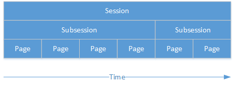

.. _conceptual_overview:

Conceptual overview
===================

Sessions
--------

In oTree, a session is an event during which multiple participants take part in a series of tasks or games.
An example of a session would be:

"A number of participants will come to the lab and play a public goods game, followed by a
questionnaire. Participants get paid EUR 10.00 for showing up, plus their earnings from the
games."

Subsessions
-----------

A session is a series of subsessions;
subsessions are the "sections" or "modules" that constitute a session.
For example, if a session consists of a public goods game followed by a questionnaire,
the public goods game would be subsession 1, and the questionnaire would be subsession 2.
In turn, each subsession is a sequence of pages.
For example, if you had a 4-page public goods game followed by a 2-page questionnaire:

If a game is repeated for multiple rounds, each round is a subsession.

Groups
------

Each subsession can be further divided into groups of players;
for example, you could have a subsession with 30 players, divided into 15 groups of 2 players each.
(Note: groups can be shuffled between subsessions.)

Object hierarchy
----------------

oTree's entities can be arranged into the following hierarchy::

    Session
        Subsession
            Group
                Player

- A session is a series of subsessions
- A subsession contains multiple groups
- A group contains multiple players
- Each player proceeds through multiple pages

You can access any higher-up object from a lower object:

.. code-block::python

    player.group
    player.subsession
    player.participant
    player.session
    group.subsession
    group.session
    subsession.session

.. _participants_and_players:

Participant
-----------

In oTree, the terms "player" and "participant" have distinct meanings.
The relationship between participant and player is the same as the
relationship between session and subsession:

.. figure:: _static/diagrams/participant_player.png
    :align: center

A player is an instance of a participant in one particular subsession.
A player is like a temporary "role" played by a participant.
A participant can be player 2 in the first subsession, player 1 in the
next subsession, etc.

