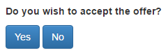

.. _forms:

Forms
=====

Each page in oTree can contain a form, which the player should fill out
and submit by clicking the "Next" button. To create a form, first
you need fields on the player model, for example:

.. code-block:: python

    class Player(BasePlayer):
        name = models.StringField(label="Your name:")
        age = models.IntegerField(label="Your age:")

Then, in your Page class, set ``form_model`` and ``form_fields``:

.. code-block:: python

    class Page1(Page):
        form_model = 'player'
        form_fields = ['name', 'age'] # this means player.name, player.age

When the user submits the form, the submitted data is automatically
saved to the corresponding fields on the player model.

.. _label:

Forms in templates
------------------

In your template, you can display the form with:

.. code-block:: html

    {{ formfields }}

.. _form-validation:

Simple form field validation
----------------------------

min and max
~~~~~~~~~~~

To require an integer to be between 12 and 24:

.. code-block:: python

    offer = models.IntegerField(min=12, max=24)

If the max/min are not fixed, you should use :ref:`FOO_max`

.. _choices:

choices
~~~~~~~

If you want a field to be a dropdown menu with a list of choices,
set ``choices=``:

.. code-block:: python

    level = models.IntegerField(
        choices=[1, 2, 3],
    )

To use radio buttons instead of a dropdown menu,
you should set the ``widget`` to ``RadioSelect`` or ``RadioSelectHorizontal``:

.. code-block:: python

    level = models.IntegerField(
        choices=[1, 2, 3],
        widget=widgets.RadioSelect
    )

If the list of choices needs to be determined dynamically, use :ref:`FOO_choices`

You can also set display names for each choice
by making a list of [value, display] pairs:

.. code-block:: python

    level = models.IntegerField(
        choices=[
            [1, 'Low'],
            [2, 'Medium'],
            [3, 'High'],
        ]
    )

If you do this, users will just see a menu with "Low", "Medium", "High",
but their responses will be recorded as 1, 2, or 3.

You can do this for ``BooleanField``, ``StringField``, etc.:

.. code-block:: python

    cooperated = models.BooleanField(
        choices=[
            [False, 'Defect'],
            [True, 'Cooperate'],
        ]
    )

You can get the human-readable label corresponding to the user's choice like this:

.. code-block:: python

    player.cooperated  # returns e.g. False
    player.field_display('cooperated')  # returns e.g. 'Defect'

.. note::

    ``field_display`` is new in oTree 5.4 (August 2021).

Optional fields
~~~~~~~~~~~~~~~

If a field is optional, you can use ``blank=True`` like this:

.. code-block:: python

    offer = models.IntegerField(blank=True)

.. _dynamic_validation:

Dynamic form field validation
-----------------------------

The ``min``, ``max``, and ``choices`` described above are only
for fixed (constant) values.
 
If you want them to be determined dynamically
(e.g. different from player to player),
then you can instead define one of the below functions.

.. _FOO_choices:

{field_name}_choices()
~~~~~~~~~~~~~~~~~~~~~~

Like setting ``choices=``,
this will set the choices for the form field
(e.g. the dropdown menu or radio buttons).

Example:

.. code-block:: python

    class Player(BasePlayer):
        fruit = models.StringField()

    def fruit_choices(player):
        import random
        choices = ['apple', 'kiwi', 'mango']
        random.shuffle(choices)
        return choices

.. _FOO_max:

{field_name}_max()
~~~~~~~~~~~~~~~~~~

The dynamic alternative to setting ``max=`` in the model field. For example:

.. code-block:: python

    class Player(BasePlayer):
        offer = models.CurrencyField()
        budget = models.CurrencyField()

    def offer_max(player):
        return player.budget

{field_name}_min()
~~~~~~~~~~~~~~~~~~

The dynamic alternative to setting ``min=`` on the model field.

.. _FOO_error_message:

{field_name}_error_message()
~~~~~~~~~~~~~~~~~~~~~~~~~~~~

This is the most flexible method for validating a field.

.. code-block:: python

    class Player(BasePlayer):
        offer = models.CurrencyField()
        budget = models.CurrencyField()

    def offer_error_message(player, value):
        print('value is', value)
        if value > player.budget:
            return 'Cannot offer more than your remaining budget'

.. _error_message:

Validating multiple fields together
~~~~~~~~~~~~~~~~~~~~~~~~~~~~~~~~~~~

Let's say your form has 3 number fields whose values must sum to 100.
You can enforce this with the ``error_message`` function, which goes on the page:

.. code-block:: python

    class MyPage(Page):

        form_model = 'player'
        form_fields = ['int1', 'int2', 'int3']

        @staticmethod
        def error_message(player, values):
            print('values is', values)
            if values['int1'] + values['int2'] + values['int3'] != 100:
                return 'The numbers must add up to 100'

Notes:

-   If a field was left blank (and you set ``blank=True``), its value here will be ``None``.
-   This function is only executed if there are no other errors in the form.
-   You can also return a dict that maps field names to error messages.
    This way, you don't need to write many repetitive FIELD_error_message methods
    (see :ref:`here <duplicate_validation_methods>`).

.. _get_form_fields:

Determining form fields dynamically
-----------------------------------

If you need the list of form fields to be dynamic, instead of
``form_fields`` you can define a function ``get_form_fields``:

.. code-block:: python

    @staticmethod
    def get_form_fields(player):
        if player.num_bids == 3:
            return ['bid_1', 'bid_2', 'bid_3']
        else:
            return ['bid_1', 'bid_2']

Widgets
-------

You can set a model field's ``widget`` to ``RadioSelect`` or ``RadioSelectHorizontal`` if you want choices
to be displayed with radio buttons, instead of a dropdown menu.

{{ formfield }}
---------------

If you want to position the fields individually,
instead of ``{{ formfields }}`` you can use ``{{ formfield }}``:

.. code-block:: html

    {{ formfield 'bid' }}

You can also put the ``label`` in directly in the template:

.. code-block:: html

    {{ formfield 'bid' label="How much do you want to contribute?" }}

The previous syntax of ```` is still supported.

.. _manual-forms:

Customizing a field's appearance
--------------------------------

``{{ formfields }}`` and ``{{ formfield }}`` are easy to use because they automatically output
all necessary parts of a form field (the input, the label, and any error messages),
with Bootstrap styling.

However, if you want more control over the appearance and layout,
you can use manual field rendering. Instead of ``{{ formfield 'my_field' }}``,
do ``{{ form.my_field }}``, to get just the input element.
Just remember to also include ``{{ formfield_errors 'my_field' }}``.

Example: Radio buttons arranged like a slider
~~~~~~~~~~~~~~~~~~~~~~~~~~~~~~~~~~~~~~~~~~~~~

.. code-block:: python

    pizza = models.IntegerField(
        widget=widgets.RadioSelect,
        choices=[-3, -2, -1, 0, 1, 2, 3]
    )

.. code-block:: html

    
Choose the point on the scale that represents how much you like pizza:

    

        Least &nbsp;
        {{ for choice in form.pizza }}
            {{ choice }}
        {{ endfor }}
        &nbsp; Most
    

.. _radio-table:
.. _subwidgets:

Example: Radio buttons in tables and other custom layouts
~~~~~~~~~~~~~~~~~~~~~~~~~~~~~~~~~~~~~~~~~~~~~~~~~~~~~~~~~

Let's say you have a set of ``IntegerField`` in your model:

.. code-block:: python

    class Player(BasePlayer):
        offer_1 = models.IntegerField(widget=widgets.RadioSelect, choices=[1,2,3])
        offer_2 = models.IntegerField(widget=widgets.RadioSelect, choices=[1,2,3])
        offer_3 = models.IntegerField(widget=widgets.RadioSelect, choices=[1,2,3])
        offer_4 = models.IntegerField(widget=widgets.RadioSelect, choices=[1,2,3])
        offer_5 = models.IntegerField(widget=widgets.RadioSelect, choices=[1,2,3])

And you'd like to present them as a likert scale, where each option is
in a separate column.

(First, try to reduce the code duplication in your model by following
the instructions in :ref:`many-fields`.)

Because the options must be in separate table cells,
the ordinary ``RadioSelectHorizontal`` widget will not work here.

Instead, you should simply loop over the choices in the field as follows:

.. code-block:: html

    <tr>
        <td>{{ form.offer_1.label }}</td>
        {{ for choice in form.offer_1 }}
            <td>{{ choice }}</td>
        {{ endfor }}
    </tr>

If you have many fields with the same number of choices,
you can arrange them in a table:

.. code-block:: html

    <table class="table">
        {{ for field in form }}
            <tr>
                <th>{{ field.label }}</th>
                {{ for choice in field }}
                    <td>{{ choice }}</td>
                {{ endfor }}
            </tr>
        {{ endfor }}
    </table>

.. _raw_html:

Raw HTML widgets
----------------

If ``{{ formfields }}`` and :ref:`manual field rendering <manual-forms>`
don't give you the appearance you want,
you can write your own widget in raw HTML.
However, you will lose the convenient features handled
automatically by oTree. For example, if the form has an error and the page
re-loads, all entries by the user may be wiped out.

First, add an ``<input>`` element.
For example, if your ``form_fields`` includes ``my_field``,
you can do ``<input name="my_field" type="checkbox" />``
(some other common types are ``radio``, ``text``, ``number``, and ``range``).

Second, you should usually include ``{{ formfield_errors 'xyz' }}``,
so that if the participant submits an incorrect or missing value),
they can see the error message.

Raw HTML example: custom user interface with JavaScript
~~~~~~~~~~~~~~~~~~~~~~~~~~~~~~~~~~~~~~~~~~~~~~~~~~~~~~~

Let's say you don't want users to fill out form fields,
but instead interact with some sort of visual app, like a clicking on a chart
or playing a graphical game. Or, you want to record extra data like how long
they spent on part of the page, how many times they clicked, etc.

First, build your interface using HTML and JavaScript.
Then use JavaScript to write the results into a
hidden form field. For example:

.. code-block:: python

    # Player class
    contribution = models.IntegerField()

    # page
    form_fields = ['contribution']

    # HTML
    <input type="hidden" name="contribution" id="contribution" />

    # JavaScript
    document.getElementById('contribution').value = 42;

When the page is submitted, the value of your hidden input will be recorded
in oTree like any other form field.

If this isn't working, open your browser's JavaScript console,
see if there are any errors, and use ``console.log()`` (JavaScript's equivalent of ``print()``)
to trace the execution of your code line by line.

Buttons
-------

Button that submits the form
~~~~~~~~~~~~~~~~~~~~~~~~~~~~

If your page only contains 1 decision,
you could omit the ``{{ next_button }}``
and instead have the user click on one of several buttons
to go to the next page.

For example, let's say your Player model has ``offer_accepted = models.BooleanField()``,
and rather than a radio button you'd like to present it as a button like this:

First, put ``offer_accepted`` in your Page's ``form_fields`` as usual.
Then put this code in the template:

.. code-block:: html

    
Do you wish to accept the offer?

    <button name="offer_accepted" value="True">Yes</button>
    <button name="offer_accepted" value="False">No</button>

You can use this technique for any type of field,
not just ``BooleanField``.

Button that doesn't submit the form
~~~~~~~~~~~~~~~~~~~~~~~~~~~~~~~~~~~

If the button has some purpose other than submitting the form,
add ``type="button"``:

.. code-block:: html

    <button>
        Clicking this will submit the form
    </button>

    <button type="button">
        Clicking this will not submit the form
    </button>

Miscellaneous & advanced
------------------------

Form fields with dynamic labels
~~~~~~~~~~~~~~~~~~~~~~~~~~~~~~~

If the label should contain a variable, you can construct the string in your page:

.. code-block:: python

    class Contribute(Page):
        form_model = 'player'
        form_fields = ['contribution']

        @staticmethod
        def vars_for_template(player):
            return dict(
                contribution_label='How much of your {} do you want to contribute?'.format(player.endowment)
            )

Then, in the template:

.. code-block:: html

    {{ formfield 'contribution' label=contribution_label }}

If you use this technique, you may also want to use :ref:`dynamic_validation`.

.. _forminputs:

JavaScript access to form inputs
~~~~~~~~~~~~~~~~~~~~~~~~~~~~~~~~

.. note::

    New beta feature as of oTree 5.9 (July 2022)

In your JavaScript code you can use ``forminputs.xyz`` to access the ``<input>``
element of form field ``xyz``. For example, you can do:

.. code-block:: javascript

    // get the value of an input
    forminputs.xyz.value; // returns '42' or '' etc.

    // set the value of a field.
    forminputs.xyz.value = '42';

    // dynamically set a field's properties -- readonly, size, step, pattern, etc.
    forminputs.xyz.minlength = '10';

    // do live calculations on inputs
    function myFunction() {
        let sum = parseInt(forminputs.aaa.value) + parseInt(forminputs.bbb.value);
        alert(`Your total is ${sum}`);
    }

    // set an event handler (for oninput/onchange/etc)
    forminputs.aaa.oninput = myFunction;

Radio widgets work a bit differently:

.. code-block:: python

    my_radio = models.IntegerField(
        widget=widgets.RadioSelect,
        choices=[1, 2, 3]
    )

.. code-block:: javascript

    // forminputs.my_radio is a RadioNodeList, not a single <input>
    // so you need to loop over all 3 options:
    for (let radio of forminputs.my_radio) {
        radio.required = '';
    }

    for (let radio of forminputs.my_radio) {
        radio.onclick = function() { alert("radio button changed"); };
    }

    // but the 'value' attribute works the same way as non-radio widgets
    forminputs.my_radio.value = 2;
