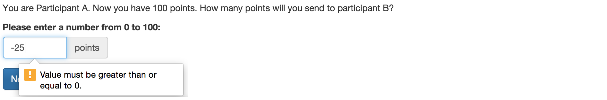

.. _forms:

Forms
=====

Each page in oTree can contain a form, which the player should fill out
and submit by clicking the "Next" button. To create a form, first
go to models.py and define fields on your Player or Group. Then,
in your Page class, you can choose which of these fields to include in the form.
You do this by setting ``form_model = 'player'``, or
``form_model = 'group'``, and then set ``form_fields``
to the list of fields you want in your form.

.. note::

    In January 2018, the syntax changed from ``form_model = models.Player``
    to ``form_model = 'player'``. See :ref:`v20` for more information.

When the user submits the form, the submitted data is automatically
saved to the field in your model.

For example, here is a models.py:

.. code-block:: python

    class Group(BaseGroup):
        f1 = models.BooleanField()
        f2 = models.BooleanField()

    class Player(BasePlayer):
        f1 = models.BooleanField()
        f2 = models.BooleanField()

And a corresponding pages.py that defines the form on each page:

.. code-block:: python

    class Page1(Page):
        form_model = 'player'
        form_fields = ['f1', 'f2'] # this means player.f1, player.f2

    class Page2(Page):
        form_model = 'group'
        form_fields = ['f1', 'f2'] # this means group.f1, group.f2

.. _label:

Forms in templates
------------------

You should include form fields by using a ```` element:

.. code-block:: html+django

    

An alternative to using ``label`` is to define ``label`` on the model field:

.. code-block:: python

    class Player(BasePlayer):
        contribution = models.CurrencyField(
            label="How much do you want to contribute?")

.. note::

    Prior to January 2018, ``label`` was called ``verbose_name``.
    See :ref:`v20` for more information.

Then you can just put this in your template:

.. code-block:: html+django

    

Or, if you have multiple form fields, you can insert them all at once:

.. code-block:: html+django

    
        
    

Note: If you have written HTML forms before, you may be accustomed to
writing the ``<input>`` element, e.g. ``<input type="text" name="contribution">``.
In oTree, it's usually easier to use ``formfield`` instead. It will autogenerate
the correct ``<input>`` HTML, along with CSS styling, label, and error messages.
However, if you want more flexibility you are free to write the raw HTML.
See :ref:`raw_html`.

.. _form-validation:

Simple form field validation
----------------------------

The player must submit a valid form before they go to the next
page. If the form they submit is invalid (e.g. missing or incorrect
values), it will be re-displayed to them along with the list of errors
they need to correct.

oTree automatically validates all input submitted by the user. For
example, if you have a form containing a ``IntegerField``, oTree
will not let the user submit values that are not positive integers, like
``-1``, ``1.5``, or ``hello``.

min and max
~~~~~~~~~~~

For example, is how you would
require an integer to be between 12 and 24:

.. code-block:: python

    # in models.py
    offer = models.IntegerField(min=12, max=24)

If the max/min are not fixed, you should use :ref:`FOO_max`

.. _choices:

choices
~~~~~~~

If you want a field to be a dropdown menu with a list of choices,
set ``choices=``:

.. code-block:: python

    # in models.py
    level = models.IntegerField(
        choices=[1, 2, 3],
    )

To use radio buttons instead of a dropdown menu,
you should set the ``widget`` to ``RadioSelect`` or ``RadioSelectHorizontal``:

.. code-block:: python

    # in models.py
    level = models.IntegerField(
        choices=[1, 2, 3],
        widget=widgets.RadioSelect
    )

If the list of choices needs to be determined dynamically, use :ref:`FOO_choices`

You can also set display names for each choice
by making a list of [value, display] pairs:

.. code-block:: python

    # in models.py
    level = models.IntegerField(
        choices=[
            [1, 'Low'],
            [2, 'Medium'],
            [3, 'High'],
        ]
    )

If you do this, users will just see a menu with "Low", "Medium", "High",
but their responses will be recorded as 1, 2, or 3.

After the field has been set, you can access the human-readable name
using
`get_FOO_display <https://docs.djangoproject.com/en/1.11/ref/models/instances/#django.db.models.Model.get_FOO_display>`__
, like this:
``self.get_level_display() # returns e.g. 'Medium'``.
However, if you define the choices dynamically with :ref:`FOO_choices`,
in order to use ``get_*_display()`` you need to also define the ``*_choices``
method on the Player/Group in models.py.

Optional fields
~~~~~~~~~~~~~~~

If a field is optional, you can use ``blank=True`` like this:

.. code-block:: python

    # in models.py
    offer = models.IntegerField(blank=True)

Then the HTML field will not have the ``required`` attribute.

.. _dynamic_validation:

Dynamic form field validation
-----------------------------

The ``min``, ``max``, and ``choices`` described above are only
for fixed (constant) values.

If you want them to be determined dynamically
(e.g. different from player to player),
then you can instead define one of the below
methods in your ``Page`` class in ``pages.py``.

.. _FOO_choices:

{field_name}_choices()
~~~~~~~~~~~~~~~~~~~~~~

Like setting ``choices=`` in models.py,
this will set the choices for the form field
(e.g. the dropdown menu or radio buttons).

Example:

.. code-block:: python

    import random

    class MyPage(Page):

        form_model = 'player'
        form_fields = ['fruit']

        def fruit_choices(self):
            choices = ['apple', 'kiwi', 'mango']
            random.shuffle(choices)
            return choices

.. _FOO_max:

{field_name}_max()
~~~~~~~~~~~~~~~~~~

The dynamic alternative to setting ``max=`` in models.py. For example:

.. code-block:: python

    class MyPage(Page):

        form_model = 'player'
        form_fields = ['offer']

        def offer_max(self):
            return self.player.endowment

{field_name}_min()
~~~~~~~~~~~~~~~~~~

The dynamic alternative to setting ``min`` in models.py.

.. _FOO_error_message:

{field_name}_error_message()
~~~~~~~~~~~~~~~~~~~~~~~~~~~~

This is the most flexible method for validating a field.

For example, let's say your form has an integer field called
``odd_negative``, which must be odd and negative: You would enforce this
as follows:

.. code-block:: python

    class MyPage(Page):

        form_model = 'player'
        form_fields = ['odd_negative']

        def odd_negative_error_message(self, value):
            print('value is', value)
            is_odd = (value % 2 == 1)
            is_negative = (value < 0)
            if not (is_odd and is_negative):
                return 'Must be odd and negative'

.. _error_message:

Validating multiple fields together
~~~~~~~~~~~~~~~~~~~~~~~~~~~~~~~~~~~

Let's say you have 3 integer fields in your form whose names are
``int1``, ``int2``, and ``int3``, and the values submitted must sum to
100. You can enforce this with the ``error_message`` method:

.. code-block:: python

    class MyPage(Page):

        form_model = 'player'
        form_fields = ['int1', 'int2', 'int3']

        def error_message(self, values):
            print('values is', values)
            if values["int1"] + values["int2"] + values["int3"] != 100:
                return 'The numbers must add up to 100'

Notes:
-   If a field was left blank (and you set ``blank=True``), its value here will be ``None``.
-   This function is only executed if there are no other errors in the form.

Determining form fields dynamically
-----------------------------------

If you need the list of form fields to be dynamic, instead of
``form_fields`` you can define a method ``get_form_fields(self)`` that
returns the list. For example:

.. code-block:: python

    class MyPage(Page):

        form_model = 'player'
        def get_form_fields(self):
            if self.player.num_bids == 3:
                return ['bid_1', 'bid_2', 'bid_3']
            else:
                return ['bid_1', 'bid_2']

But if you do this, you must make sure your template
also contains conditional logic so that the right ``formfield`` elements
are included.

You can do this by looping through each field in the form.
oTree passes a variable ``form`` to each template, which you can loop through
like this:

.. code-block:: django

    <!-- in your HTML template -->
    
        
    

(If you need more complex looping logic than this,
then consider not using ```` and instead writing the
raw HTML for the ``<input>`` elements; see :ref:`radio-table`.)

``form`` is a special variable.
It is a Django form object, which is an iterable whose elements are Django form
field objects. ``formfield`` can take as an argument a Django field object,
or it can be an expression like ```` and
````, but ``player.foo`` must be written explicitly
rather than assigning ``somevar = player.foo`` and then doing
````.

If you use this technique, you should consider setting
``label`` on your model fields (see :ref:`label`).

Widgets
-------

The full list of form input widgets offered by Django is
`here <https://docs.djangoproject.com/en/1.7/ref/forms/widgets/#built-in-widgets>`__.

oTree additionally offers:

-   ``RadioSelectHorizontal`` (same as ``RadioSelect`` but with a horizontal
    layout, as you would see with a Likert scale)
-   ``Slider``

    -   To specify the step size, do: ``Slider(attrs={'step': '0.01'})``
    -   To disable the current value from being displayed, do:
        ``Slider(show_value=False)``

.. _django-forms:

Customizing a field's appearance
--------------------------------

```` is easy to use because it automatically outputs
all necessary parts of a form field (the input, the label, and any error messages),
with Bootstrap styling.

However, if you want more control over the appearance and layout,
you can use Django's manual field rendering. Instead of ````,
do ``{{ form.my_field }}``, to get just the input,
and then position it as you want.

Just remember to also include ``{{ form.my_field.errors }}``,
so that if there is an error in the form,
the participant will see the error message.

More info `here <https://docs.djangoproject.com/en/1.9/topics/forms/#rendering-fields-manually>`__.

.. _radio-table:
.. _subwidgets:

Example: Radio buttons in tables and other custom layouts
~~~~~~~~~~~~~~~~~~~~~~~~~~~~~~~~~~~~~~~~~~~~~~~~~~~~~~~~~

Let's say you have a set of ``IntegerField`` in your model:

.. code-block:: python

    class Player(BasePlayer):

        offer_1 = models.IntegerField(widget=widgets.RadioSelect, choices=[1,2,3])
        offer_2 = models.IntegerField(widget=widgets.RadioSelect, choices=[1,2,3])
        offer_3 = models.IntegerField(widget=widgets.RadioSelect, choices=[1,2,3])
        offer_4 = models.IntegerField(widget=widgets.RadioSelect, choices=[1,2,3])
        offer_5 = models.IntegerField(widget=widgets.RadioSelect, choices=[1,2,3])

And you'd like to present them as a likert scale, where each option is
in a separate column.

(First, try to reduce the code duplication in models.py by following
the instructions in :ref:`many-fields`.)

Because the options must be in separate table cells,
the ordinary ``RadioSelectHorizontal`` widget will not work here.

Instead, you should simply loop over the choices in the field as follows:

.. code-block:: html+django

    <tr>
        <td>{{ form.offer_1.label }}</td>
        
            <td>{{ choice }}</td>
        
    </tr>

.. note::

    This feature is only available in oTree 2.0 and higher.

If you have many fields with the same number of choices,
you can arrange them in a table:

.. code-block:: html+django

    <table class="table">
        
            <tr>
                <th>{{ field.label }}</th>
                
                    <td>{{ choice }}</td>
                
            </tr>
        
    </table>

You can also get choices individually by using their 0-based index,
e.g. ``{{ form.my_field.0 }}`` gives you the radio button of the first choice.
For more granular control, as described `here <https://docs.djangoproject.com/en/1.11/ref/forms/widgets/#radioselect>`__,
you can use the ``choice_label`` and ``tag`` attributes on a field choice.

.. _raw_html:

Advanced: Raw HTML widgets
--------------------------

If ```` and :ref:`manual field rendering <django-forms>`
are still not flexible enough for you,
you can write the raw HTML for your form input.
However, you will lose the convenient features handled
automatically by oTree. For example, if the form has an error and the page
re-loads, all entries by the user may be wiped out.

To use raw HTML, just ensure that each field in your Page's ``form_fields``
has a corresponding ``<input>`` element with a matching ``name`` attribute.

Remember that for any field ``my_field``,
you should include ``{{ form.my_field.errors }}``,
so that if there is an error in the form,
the participant will see the error message.

Raw HTML example: custom user interface with JavaScript
~~~~~~~~~~~~~~~~~~~~~~~~~~~~~~~~~~~~~~~~~~~~~~~~~~~~~~~

Let's say you don't want users to fill out form fields,
but instead interact with some sort of visual app, like a clicking on a chart
or playing a graphical game. Or, you want to record extra data like how long
they spent on part of the page, how many times they clicked, etc.

You can build these interfaces in any front-end framework you want.
Simple ones can be done with jQuery; more complex ones would use something
like React or Polymer.

Then, use JavaScript to record the relevant data points and store it in a
hidden form field. For example:

.. code-block:: python

    # models.py
    my_hidden_input = models.IntegerField()

    # pages.py
    form_fields = ['my_hidden_input']

    # HTML template
    <input type="hidden" name="my_hidden_input"
        value="5" id="id_my_hidden_input"/>

Then you can use JavaScript to set the value of that input, by selecting
the element by id ``id_my_hidden_input``, and setting its ``value`` attribute.

When the page is submitted, the value of your hidden input will be recorded
in oTree like any other form field.

Buttons
-------

Button that submits the form
~~~~~~~~~~~~~~~~~~~~~~~~~~~~

If your page only contains 1 decision,
you could omit the ````
and instead have the user click on one of several buttons
to go to the next page.

For example, let's say your models.py has ``offer_accepted = models.BooleanField()``,
and rather than a radio button you'd like to present it as a button like this:

.. image:: _static/forms/yes-no-buttons.png
    :align: center
    :scale: 100 %

First, put ``offer_accepted`` in your Page's ``form_fields`` as usual.
Then put this code in the template
(the ``btn`` classes are just for Bootstrap styling):

.. code-block:: html+django

    

        
<b>Do you wish to accept the offer?</b>

        

            <button name="offer_accepted" value="True" class="btn btn-primary btn-large">Yes</button>
            <button name="offer_accepted" value="False" class="btn btn-primary btn-large">No</button>
        

    

You can use this technique for any type of field,
not just ``BooleanField``.

Button that doesn't submit the form
~~~~~~~~~~~~~~~~~~~~~~~~~~~~~~~~~~~

If the button has some purpose other than submitting the form,
add ``type="button"`` to the ``<button>``:

.. code-block:: html+django

    

        <button>
            Clicking this will submit the form
        </button>

        <button type="button">
            Clicking this will not submit the form
        </button>

    

Miscellaneous & advanced
------------------------

Forms with a dynamic vector of fields
~~~~~~~~~~~~~~~~~~~~~~~~~~~~~~~~~~~~~

Let's say you want a form with a vector of n fields that are identical, except for some numerical index, e.g.:

.. code-block:: python

    contribution[1], contribution[2], ..., contribution[n]

Furthermore, suppose n is variable (can range from 1 to N).

Currently in oTree, you can only define a fixed number of fields in a model.
So, you should define in ``models.py`` N fields (``contribution_1...contribution_N...``),
and then use ``get_form_fields`` as described above to dynamically return a list with the desired subset of these fields.

For example, let's say the above variable ``n`` is actually an ``IntegerField`` on the player,
which gets set dynamically at some point in the game. You can use ``get_form_fields``
like this:

.. code-block:: python

    class MyPage(Page):

        form_model = 'player'
        def get_form_fields(self):
            return ['contribution_{}'.format(i) for i in range(1, self.player.n + 1)]

Form fields with dynamic labels
~~~~~~~~~~~~~~~~~~~~~~~~~~~~~~~

If the label should contain a variable, you can construct the string in ``pages.py``:

.. code-block:: python

    class Contribute(Page):
        form_model = 'player'
        form_fields = ['contribution']

        def vars_for_template(self):
            return {
                'contribution_label': 'How much of your {} do you want to contribute?'.format(self.player.endowment)
            }

Then in the template, set the label to this variable:

.. code-block:: html+django

    

If you use this technique, you may also want to use :ref:`dynamic_validation`.
