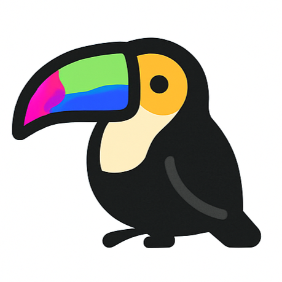

.. oTree documentation master file, created by
   sphinx-quickstart on Tue May 26 10:36:49 2015.
   You can adapt this file completely to your liking, but it should at least
   contain the root `toctree` directive.

.. only:: html

    oTree
    =====

    .. image:: _static/splash.png
        :align: center

    .. raw:: html

       

`中文 <https://otree.readthedocs.io/zh_CN/latest/index.html>`__ | `日本語 <https://otree.readthedocs.io/ja/latest/index.html>`__ | `Español <https://otree.readthedocs.io/es/latest/index.html>`__

.. note::

   |otai-icon| **February 2026 update**: `OTAI <https://www.otreehub.com/>`__ allows you to build oTree apps through a chat interface, without coding.
   It's highly trained on oTree experiments.

Live demos
^^^^^^^^^^

https://www.otreehub.com/projects/?featured=1

Homepage
^^^^^^^^

http://www.otree.org/

About
^^^^^

oTree is a framework based on Python that lets you build:

- Multiplayer strategy games, like the prisoner's dilemma, public goods game, and auctions
- Controlled behavioral experiments in economics, psychology, and related fields
- Surveys and quizzes

Support
^^^^^^^

For help, post to our `forum <https://www.otreehub.com/forum/>`__.

Contents:
^^^^^^^^^

.. toctree::
    :maxdepth: 2

    install.rst
    python.rst
    tutorial/intro.rst
    conceptual_overview.rst
    OTAI <https://www.otreehub.com>
    models.rst
    pages.rst
    templates.rst
    forms.rst
    multiplayer/intro.rst
    rounds.rst
    treatments.rst
    timeouts.rst
    bots.rst
    live.rst
    server/intro.rst
    admin.rst
    rooms.rst
    currency.rst
    mturk.rst
    misc/intro.rst

Indices and tables
==================

* :ref:`genindex`
* :ref:`modindex`
* :ref:`search`

(Thank you to contributors)