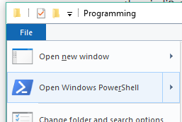

:orphan:

.. _install-windows:

Installing oTree on Windows
===========================

Important note
--------------

If you publish research done with oTree,
you are required to cite
`this paper <http://dx.doi.org/10.1016/j.jbef.2015.12.001>`__.
(Citation: Chen, D.L., Schonger, M., Wickens, C., 2016. oTree - An open-source
platform for laboratory, online and field experiments.
Journal of Behavioral and Experimental Finance, vol 9: 88-97)

If the below steps don't work for you, please email chris@otree.org with details.

Step 1: Install Python
----------------------

Download and install `Python 3.7 <https://www.python.org/ftp/python/3.7.3/python-3.7.3-amd64.exe>`__.
Check the box to add Python to PATH:

.. figure:: _static/setup/py-win-installer.png

Step 2: Install oTree
---------------------

Go to the folder where you want to store your oTree project.
Then click the "File" menu and open PowerShell:

Enter this command at the prompt:

.. code-block:: bash

    pip3 install -U otree

.. note::

    If you get an error like this::

        error: Microsoft Visual C++ is required (Unable to find vcvarsall.bat).

    To fix this, install the `Visual C++ Build Tools <http://go.microsoft.com/fwlink/?LinkId=691126>`__.

Next steps
----------

-   If you will use :ref:`oTree Studio <studio>`,
    go to `otreehub.com/studio <https://www.otreehub.com/studio/>`__
    and create a project.
-   If you will use PyCharm or another text-based code editor,
    follow the steps :ref:`here <install-nostudio>`.
