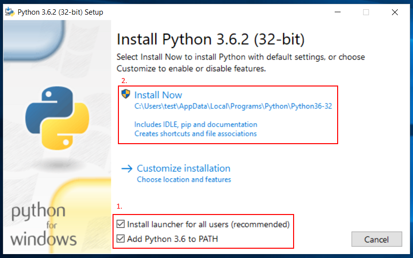
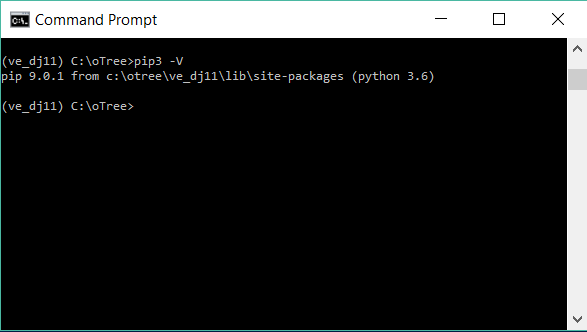
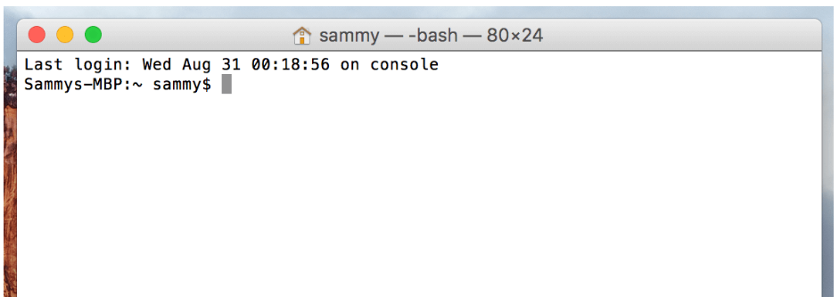
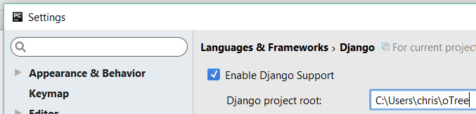

.. _setup:

Installing oTree
================

Important note
--------------

If you publish research conducted using oTree,
you are required by the oTree license to cite
`this paper <http://dx.doi.org/10.1016/j.jbef.2015.12.001>`__.
(Citation: Chen, D.L., Schonger, M., Wickens, C., 2016. oTree - An open-source
platform for laboratory, online and field experiments.
Journal of Behavioral and Experimental Finance, vol 9: 88-97)

Step 1: Install Python
----------------------

oTree requires Python 3.6 or higher.

If you already have Python 3.6 installed
(check by entering ``pip3 -V`` at your command prompt),
you can skip the below section. Or, uninstall your existing version of Python,
and proceed with the below steps.

Step 1: Install Python 3.6 (for Windows users)
~~~~~~~~~~~~~~~~~~~~~~~~~~~~~~~~~~~~~~~~~~~~~~

Download and install `Python 3.6 <https://www.python.org/downloads/release/python-360/>`__.
Check the box to add Python to PATH:

Once setup is done, search in your Windows Start Menu for the program "Command Prompt",
open Command Prompt, and enter ``pip3 -V``:

Step 1: Install Python 3.6 (for macOS users)
~~~~~~~~~~~~~~~~~~~~~~~~~~~~~~~~~~~~~~~~~~~~

*   Download and install the latest `Python 3 <https://www.python.org/downloads/mac-osx/>`__.

*   In Finder, search for and open the "Terminal" app:

*   Then type ``pip3 -V`` and hit enter. This should output something like::

        pip N.N.N from /Library/Frameworks/Python.framework/[...] (python 3.6)

    If not, try closing and reopening the "Terminal" app.

*   Run this command::

    /Applications/Python\ 3.6/Install\ Certificates.command

If the above steps don't work for you, please email chris@otree.org with details.

(If you are more experienced with the command line,
you can instead install Python using Homebrew.)

Step 1: Install Python 3.6 (for Linux/Unix users)
~~~~~~~~~~~~~~~~~~~~~~~~~~~~~~~~~~~~~~~~~~~~~~~~~

We recommmend installing using your system's package manager to install Python 3.6.
If ``Twisted`` fails to compile, install the ``python-dev`` package (e.g. through ``apt-get``).

More information in the :ref:`Linux server setup <server-ubuntu>` section.

Step 2: Install oTree
---------------------

Enter this in Command Prompt (Windows) or Terminal (macOS):

.. code-block:: bash

    pip3 install -U otree

.. note::

    If you get this Windows error about Twisted and ``vcvarsall.bat``::

        error: Microsoft Visual C++ 9.0 is required (Unable to find vcvarsall.bat). Get it from http://aka.ms/vcpython27

    To fix this, install the `Visual C++ Build Tools <http://go.microsoft.com/fwlink/?LinkId=691126>`__.

Step 3: Run oTree
-----------------

Open Command Prompt or PowerShell (on Windows) or Terminal (on macOS), and run::

    otree startproject oTree

If it's your first time, we recommend choosing the option to include the sample games.

The above command will create a folder named ``oTree`` in your home folder.
(If you want, you can move the folder to another location.)

Then change to the folder you just created::

    cd oTree

.. note::

    If you've never used a command prompt like Terminal, Command Prompt, or PowerShell,
    basically all you need to know is it is an alternative
    to your file explorer (or Finder on Mac). Instead of clicking on files
    and folders, you type commands to navigate folders and execute programs.

    Here are some useful commands:

    -   ``pwd``: shows what folder you are currently in
    -   ``dir`` (Windows): lists the files and subfolders in the current folder
    -   ``ls`` (Mac/Linux): lists the files and subfolders in the current folder
    -   ``cd``: move to a subfolder. For example, ``cd oTree`` takes you to the subfolder ``oTree``.

Reset the database::

    otree resetdb

(You might see a message about migrations; you can ignore that.)

Then run the server::

    otree runserver

Then open your browser to `http://127.0.0.1:8000/ <http://127.0.0.1:8000/>`__.
You should see the oTree demo site.

To stop the server, enter ``Control + C`` at your command line.
To restart the server from the command line, pressing your keyboard's "up" arrow (this will retrieve the last command you entered),
and hit Enter.

.. _pycharm:

Step 4: Install a Python editor (PyCharm)
-----------------------------------------

You will need a text editor to write your Python code.

We recommend using `PyCharm <https://www.jetbrains.com/pycharm/download/>`__.
Professional Editon is better than Community Edition because it has
Django support.
PyCharm Professional is free if you are a student, teacher, or professor.

Even if you normally use another text editor,
we recommend at least trying PyCharm, because PyCharm's autocompletion
makes learning oTree much easier:

.. figure:: _static/setup/pycharm-autocomplete.gif

Once you have installed PyCharm,
go to "File -> Open..." and select the folder you created with ``otree startproject``.

Then click on ``File –> Settings`` (Windows) or ``PyCharm -> Preferences`` (Mac).

First, go to "Project interpreter" and set it to the location of your Python executable.
on Windows, it would usually be something like
``C:\Users\<your_username>\AppData\Local\Programs\Python\Python36-32``,
and on Mac, it would usually be something like
``/Library/Framework/Python.framework/Versions/3.6/bin/python3.6``)

Then, also in settings, navigate to ``Languages & Frameworks -> Django``,
check "Enable Django Support" and set your oTree folder as the Django project root,
with your ``manage.py`` and ``settings.py``:

If PyCharm displays this warning, select "Ignore requirements":

Command line tips & tricks
--------------------------

Here are some tips to using Command Prompt/PowerShell (for Windows users) or Terminal (for macOS users):

A few tips:

* You can retrieve the previous command you entered by pressing your keyboard's "up" arrow
* If you get stuck running a command, you can press ``Control + C``.
* In Command Prompt & PowerShell, you should right-click to paste a command.

.. _upgrade:
.. _upgrade-otree-core:

Upgrading/reinstalling oTree
----------------------------

We recommend you do this on a weekly basis,
so that you can get the latest bug fixes and features.
This will also ensure that you are using a version that is consistent with the current documentation.

Run:

.. code-block:: bash

    pip3 install -U otree
    otree resetdb
