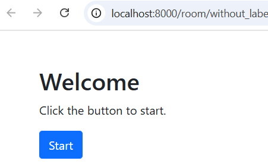
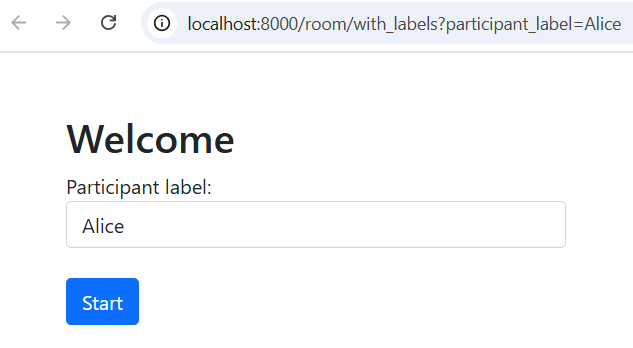
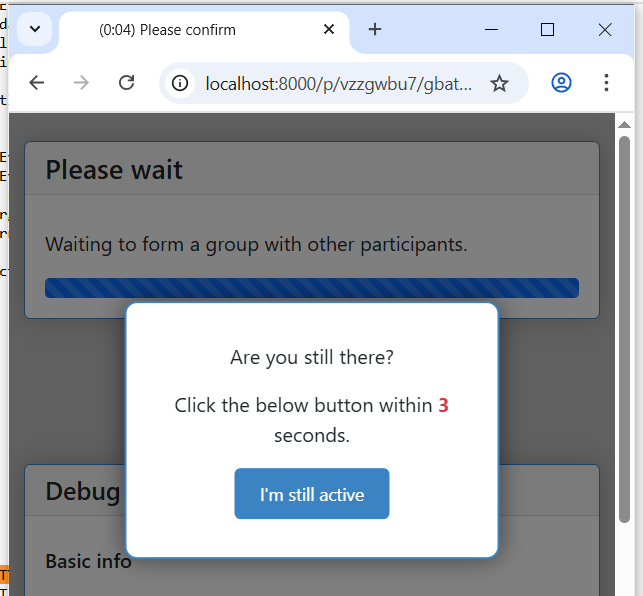
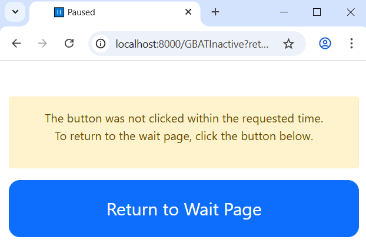

.. _version-history:

Version history
```````````````

.. _v60:

Version 6.0 Beta (October 2025)
===============================

You can install this beta release with:

.. code-block:: bash

    pip install otree --upgrade --pre

Back button
-----------

See :ref:`back_button`.

Preserving unsubmitted forms
----------------------------

See :ref:`preserve_unsubmitted_form`.

Filtering fields in admin data view
-----------------------------------

See :ref:`ADMIN_VIEW_FIELDS`.


Support for web APIs (ChatGPT etc)
----------------------------------

See :ref:`async_live_method`.

Welcome pages for rooms
-----------------------

When you use a Room, oTree will always show a Welcome page
that asks the user to confirm to start.

Room without participant label file:




Room with participant label file:



This solves the problem where start links were being opened
by various platforms like WhatsApp that scan messages and open hyperlinks automatically,
making oTree count those participants as having begun the experiment.

Furthemore, these welcome pages are customizable.

See :ref:`welcome-page`.


group_by_arrival_time presence detection
----------------------------------------

We changed how ``group_by_arrival_time`` excludes participants based on inactivity.
Previously, inactivity was automatically determined based on whether the tab is open and active.

Now, if a participant has not shown any signs of activity within **2 minutes**
(e.g. not moved their mouse), they are asked if they are still there.
Note the live countdown is also shown in the page tab title:


    
This starts a countdown. If they don't respond within **15 seconds** 
(by clicking the button or at least moving their mouse), 
they are sent to an "inactive" page with a big button they can click to return to the wait page:



.. note::

    The text displayed to users is preliminary and has not been translated
    to languages other than English.

The timing parameters are configurable in ``settings.py``:

.. warning::

    These settings are experimental and may be removed or changed.

.. code-block:: python

    GBAT_INACTIVE_SECONDS_UNTIL_PROMPT = 2 * 60
    GBAT_INACTIVE_SECONDS_TO_CONFIRM = 15


Session-wide links
------------------

Previously, if a participant opened a session-wide start link twice in the same browser, 
it would use up 2 participants.
Now, we check if the start link was already clicked, using a cookie.
If yes, we continue where they left off.

Caveats:

-   This new behavior only applies with non-demo sessions. 
-   You generally shouldn't be using session-wide links anyway, room links are much more stable.

Number formatting
-----------------

-   ``THOUSAND_SEPARATOR`` setting (to display numbers like "1,234,567.00")
-   ``to3`` and ``to4`` filters in templates

See :ref:`number_formatting` for details.

Misc
~~~~

-   Bots do ``custom_export``
-   Easier debugging of live pages. JS console shows when there is a server error,
    and server tracebacks are shorter.
-   ``to3`` and ``to4`` filter in templates
-   green/gray presence icons in the "Monitor" page when participants are on waitpages
-   ``read_csv()`` supports semicolon delimited files
-   In ``DEBUG`` mode, at the bottom of the page there is a link to start as a new participant.
-   Made navigation between room and active session more intuitive and clear.
-   ``live_method`` cannot be a string anymore.
-   chat widget now uses a ``<textarea>`` instead of ``<input>``.
-   Async ``live_method`` does not work with bots and ``call_live_method`` yet.


Version 5.10
============

For IntegerField/FloatField/CurrencyField, if ``min`` is not specified, it will be assumed to be 0.
If you need a form field to accept negative values, set ``min=`` to a negative value (or ``None``).

Benefits of this change:

-   Most numeric inputs on mobile can now use the numeric keypad
-   Prevents unintended negative inputs from users.
    For example, if you forgot to specify ``min=0`` for your "contribution" field,
    then a user could 'hack' the game by entering a negative contribution.

Other changes:

-   MTurk integration works even on Python >= 3.10 (removed dependency on the boto3 library)
-   Python 3.11 support
-   bots: better error message when bot is on the wrong page


Version 5.9
===========

-   Improved dropout detection
-   Renamed ``formInputs`` (JavaScript variable) to ``forminputs``
-   5.9.5: fix bug that points inputs allow decimal numbers when they should be whole numbers.

Version 5.8
===========

-   Better dropout detection with group_by_arrival_time; see `here <https://groups.google.com/g/otree/c/XsFMNoZR7PY>`__.
-   Python 3.10 support
-   Fix various websocket-related errors such as ConnectionClosedOK, IncompleteReadError, ClientDisconnect that tend to happen intermittently, especially with browser bots.

Version 5.6
===========

-   Added access to form inputs through JavaScript.

Version 5.4
===========

-   PARTICIPANT_FIELDS are now included in data export
-   :ref:`field_maybe_none`
-   Radio buttons can now be accessed by numeric index, e.g. ``{{ form.my_field.0 }}``.
-   Bugfix with numpy data types assigned to model fields
-   Misc improvements and fixes

Version 5.3
===========

-   Bugfix to deleting sessions in devserver
-   ``{{ static }}`` tag checks that the file exists
-   In SessionData tab, fix the "next round"/"previous round" icons on Mac
-   Fix to currency formatting in Japanese/Korean/Turkish currency (numbers were displayed with a decimal when there should be none)
-   allow error_message to be run on non-form pages (e.g. live pages)
-   Better error reporting when an invalid value is passed to ``js_vars``
-   Minor fixes & improvements


Version 5.2
===========

-   For compatibility with oTree 3.x,
    formfield ``<input>`` elements now prefix their ``id`` attribute with ``id_``.
    If you use ``getElementById``/``querySelector``/etc. to select any formfield inputs,
    you might need to update your selectors.
-   The data export now outputs "time started" as UTC.
-   "Time spent" data export has a column name change.
    If you have been using the ``pagetimes.py`` script,
    you should download the new version.

Version 5.1
===========

-   Breaking changes to REST API

Version 5.0
===========

-   oTree Lite
-   The no-self format
-   The beta method ``Player.start()`` has been removed.
-   ``cu()`` is now available as an alias for ``Currency``.
    ``c()`` will still work as long as you have ``from otree.api import Currency as c``
    at the top of your file.
    More details `here <https://groups.google.com/g/otree/c/Bwv67asPIlo>`__.
-   oTree 3.x used two types of tags in templates: ``{{ }}`` and ````.
    Starting in oTree 5, however, you can forget about ```` and just use ``{{ }}`` everywhere if you want.
    More details `here <https://groups.google.com/g/otree/c/Bwv67asPIlo>`__.
-   All REST API calls now return JSON

Version 3.3
===========

-   BooleanField now uses radio buttons by default (instead of dropdown)
-   ``otree zip`` can now keep your requirements.txt up to date.
-   oTree no longer installs `sentry-sdk`. If you need Sentry on Heroku, you should add it to your `requirements.txt` manually.
-   Faster server
-   Faster startup time
-   Faster installation
-   Data export page no longer outputs XLSX files. Instead it outputs CSV files formatted for Excel
-   Admin UI improvements, especially session data tab

Version 3.2
===========

-   Should use less memory and have fewer memory spikes.
-   Enhancements to SessionData and SessionMonitor.

Version 3.1
===========

-   New way to define :ref:`roles`
-   You can pass a string to ``formfield``, for example ``{{ formfield 'contribution' }}``.

Version 3.0
===========

Live pages
----------

See :ref:`live`.

REST API
--------

See :ref:`rest`

Custom data export
------------------

See :ref:`custom-export`.

Other things
------------

-   Python 3.8 is now supported.
-   Speed improvements to devserver & zipserver
-   You can now download a single session's data as Excel or CSV (through session's Data tab)
-   When browser bots complete, they keep the last page open
-   group_by_arrival_time: quicker detection if a participant goes offline
-   Browser bots use the REST API to create sessions
    (see :ref:`rest`).
-   Instead of ``runprodserver`` you can now use ``prodserver`` (that will be the preferred name going forward).
-   "Page time" data export now has more details such as whether it is a wait page.
-   ``devserver`` and ``zipserver`` now must use ``db.sqlite3`` as the database.


Version 2.5
===========
-   Removed old ``runserver`` command.
-   Deprecated non-oTree widgets and model fields. See `here <https://groups.google.com/forum/#!topic/otree/vsvsQ7njjY8>`__.

Version 2.4
===========

-   ``zipserver`` command
-   New MTurk format
-   oTree no longer records participants' IP addresses.

Version 2.3
===========

-   Various improvements to performance, stability, and ease of use.
-   oTree now requires Python 3.7
-   oTree now uses Django 2.2.
-   Chinese/Japanese/Korean currencies are displayed as 元/円/원 instead of ¥/₩.
-   On Windows, ``prodserver`` just launches 1 worker process. If you want more processes,
    you should use a process manager. (This is due to a limitation of the ASGI server)
-   ``prodserver`` uses Uvicorn/Hypercorn instead of Daphne
-   update_my_code has been removed

Version 2.2
===========

-   support for the ``otreezip`` format
    (``otree zip``, ``otree unzip``)
-   MTurk: in sandbox mode, don't grant qualifications
    or check qualification requirements
-   MTurk: before paying participants, check if there is adequate
    account balance.
-   "next button" is disabled after clicking, to prevent congesting the server
    with duplicate page loads.
-   Upgrade to the latest version of Sentry
-   Form validation methods should go on the model, not the page.
    See :ref:`dynamic_validation`
-   :ref:`app_after_this_page`
-   Various performance and stability improvements

.. _v21:

Version 2.1
===========

-   oTree now raises an error if you use an undefined variable in your template.
    This will help catch typos like
    ``{{ Player.payoff }}`` or ``{{ if player.id_in_gruop }}``.
    This means that apps that previously worked may now get a template error
    (previously, it failed silently).
    If you can't remove the offending variable,
    you can apply the ``|default`` filter, like: ``{{ my_undefined_variable|default:None }}``
-   oTree now warns you if you use an invalid attribute on a Page/WaitPage.
-   CSV/Excel data export is done asynchronously, which will fix
    timeout issues for large files on Heroku.
-   Better performance, especially for "Monitor" and "Data" tab in admin interface
