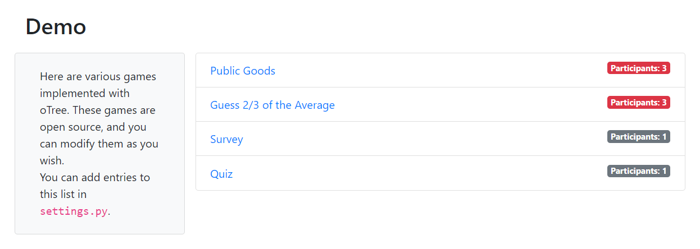
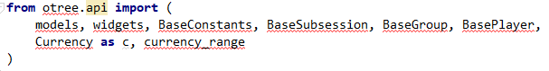

Workshop
========

[This page is for participants in oTree workshops]

To make sure we make the best use of our limited time at the upcoming
oTree workshop, please ensure you have adequately prepared by checking the
following.

Step 1: Make sure oTree is properly installed
---------------------------------------------

Follow the instructions on :ref:`install` to install oTree and PyCharm.

When you run the server, you should be able to go to ``http://localhost:8000``
and see this:

Step 2: Make sure PyCharm is properly installed
-----------------------------------------------

In PyCharm, go to ``public_goods/models.py``.
The top of the file should look like this:

.. figure:: ../_static/workshop/pycharm-correct.png

It should NOT be underlined in red like this
(this means PyCharm cannot find the correct Python installation):

Step 3: Make sure you understand Python
---------------------------------------

Follow the Python tutorial :ref:`here <python_tutorial>`.
Once you are done, you should be able to answer the questions in the following quiz
(solutions are :download:`here <quiz_solutions.py>`).

Question 1
~~~~~~~~~~

Consider the following dictionary:

.. code-block:: python

    v1 = {
        2: 0,
        4: 1,
        1: 3,
    }

What is ``v1[1]``?
(You can check your answer by testing it at your Python prompt.)

Question 2
~~~~~~~~~~

Consider the following list:

.. code-block:: python

    v2 = [2, 3, 1]

What is ``v2[1]``?
(You can check your answer by testing it at your Python prompt.)

Question 3
~~~~~~~~~~

Write a function ``double`` that doubles a given number.

Question 4
~~~~~~~~~~

Write a function ``double_list`` that takes a list of numbers,
and returns a list where each number is double the original.
For example: ``double_list([1,2])`` should be ``[2,4]``.

Question 5
~~~~~~~~~~

Consider a list of people like this:

.. code-block:: python

    people = [
        {'name': 'Alice', 'gender': 'F', 'age': 15},
        {'name': 'Bob', 'gender': 'M', 'age': 20},
        {'name': 'Claire', 'gender': 'F', 'age': 25},
        {'name': 'David', 'gender': 'M', 'age': 30},
        # etc....
    ]

Write a function ``names()`` that takes in a list like this and returns
just the names of the players.
For example ``names(people)`` should return:

.. code-block:: python

    ['Alice', 'Bob', 'Claire', 'David']

Question 6
~~~~~~~~~~

Using the same structure from above,
write a function ``filter_adult()`` that
returns just the people over 18 years old. For example, if the list
just contains the above 4 entries, ``filter_adult(people)`` should return:

.. code-block:: python

    [{'age': 20, 'gender': 'M', 'name': 'Bob'},
     {'age': 25, 'gender': 'F', 'name': 'Claire'},
     {'age': 30, 'gender': 'M', 'name': 'David'}]

Question 7
~~~~~~~~~~

Using the same structure from above,
Write a function ``sum_age_by_gender()`` that adds up the ages of each gender
and returns a dictionary with those sums.
For example, ``sum_age_by_gender(people)`` should return ``{'M': 50, 'F': 40}``.
