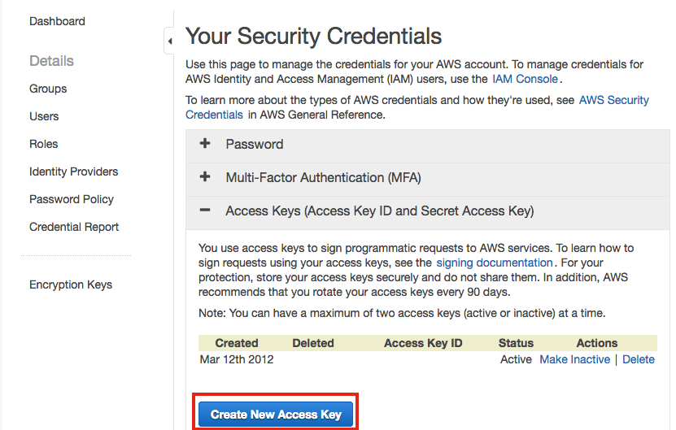
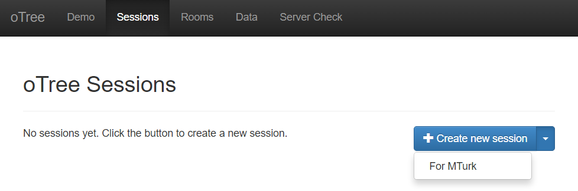

Mechanical Turk
===============

Overview
--------

oTree provides integration with Amazon Mechanical Turk (MTurk).

You can publish your game to MTurk directly from
oTree's admin interface. Then, workers on mechanical Turk can accept and
play your app as an MTurk HIT and get paid a participation fee as well
as bonuses they earned by playing your game.

.. warning::

    Use caution when running games on Mechanical Turk with live interaction
    between participants (i.e. wait pages). See below.

.. _v14_mturk:

Installation
------------

If you want to use oTree with MTurk,
you need to install ``otree[mturk]`` instead of just ``otree``.

Your ``requirements_base.txt`` should also have ``otree[mturk]``.

AWS credentials
---------------

You must create an employer account with MTurk,
and then enter your MTurk keys into oTree.

You can obtain these credentials `here <https://console.aws.amazon.com/iam/home?#security_credential>`__:

For security, it's best to put these keys in an environment variable.
On Heroku you would set these env vars like this:

.. code-block:: bash

    heroku config:set AWS_ACCESS_KEY_ID=YOUR_AWS_ACCESS_KEY_ID
    heroku config:set AWS_SECRET_ACCESS_KEY=YOUR_AWS_SECRET_ACCESS_KEY

(For servers not on Heroku, to learn what an "environment variable" is,
see `here <http://superuser.com/a/284351>`__.)

Next, allow oTree to read these keys from the environment variables,
by adding the following lines to your ``settings.py``::

    AWS_ACCESS_KEY_ID = environ.get('AWS_ACCESS_KEY_ID')
    AWS_SECRET_ACCESS_KEY = environ.get('AWS_SECRET_ACCESS_KEY')

.. warning::

    When testing with oTree, don't keep too much money in your MTurk account,
    in case something goes wrong.

Session config
--------------

Add this to your settings.py (if not there already) and edit as necessary:

.. code-block:: python

    mturk_hit_settings = {
        'keywords': ['bonus', 'study'],
        'title': 'Title for your experiment',
        'description': 'Description for your experiment',
        'frame_height': 500,
        'preview_template': 'global/MTurkPreview.html',
        'minutes_allotted_per_assignment': 60,
        'expiration_hours': 7*24, # 7 days
        #'grant_qualification_id': 'YOUR_QUALIFICATION_ID_HERE',# to prevent retakes
        'qualification_requirements': []
    }

Then in ``SESSION_CONFIG_DEFAULTS``, add the entry:

.. code-block:: python

    'mturk_hit_settings': mturk_hit_settings,

Making your session work on MTurk
---------------------------------

The monetary reward paid to workers is
``self.session.config['participation_fee']``.

When you publish your HIT to MTurk, it will be visible to workers. When
a worker clicks on the link to take part in the HIT, they will see the
MTurk interface, with your app loaded inside a frame (as an
``ExternalQuestion``). Initially, they will be in preview mode, and will
see the ``preview_template`` you specify in ``settings.py``. After they
accept the HIT, they will see the first page of your session, and be
able to play your session while it is embedded inside a frame in the
MTurk worker interface.

The only modification you should make to your app for it to work on AMT
is to add a ```` to the final page that your
participants see. When the participant clicks this button, they will be
directed back to the mechanical Turk website and their work will be
submitted.

After workers have completed the session, you can click on the
"payments" Tab for your session. Here, you will be able to approve
submissions, and also pay the bonuses that workers earned in your game.

Testing your hit in sandbox
---------------------------

The Mechanical Turk Developer Sandbox is a simulated environment that
lets you test your app prior to publication in
the marketplace. This environment is available for both
`worker <https://workersandbox.mturk.com/mturk/welcome>`__ and
`requester <https://requester.mturk.com/developer/sandbox>`__.

From the oTree admin interface, click on "Sessions" and then,
on the split button "Create New Session", select "For MTurk":

Once you have created the session, you will see an "MTurk" tab in the session's admin page.

After publishing the HIT you can test it both as a worker and as a
requester using the links provided on the "MTurk" Tab of your session admin
panel.

.. _qualification-requirements:

Qualification requirements
~~~~~~~~~~~~~~~~~~~~~~~~~~

Since oTree 1.4 (summer 2017), oTree uses boto3 syntax for qualification requirements.

Here is an example with 2 qualification requirements:

.. code-block:: python

    mturk_hit_settings = {
        'title': 'Title for your experiment',
        'description': 'Description for your experiment',
        # other properties omitted for clarity...

        'qualification_requirements': [
            {
                'QualificationTypeId': "3AWO4KN9YO3JRSN25G0KTXS4AQW9I6",
                'Comparator': "DoesNotExist",
            },
            {
                'QualificationTypeId': "4AMO4KN9YO3JRSN25G0KTXS4AQW9I7",
                'Comparator': "DoesNotExist",
            },
        ]
    }

Here is how you would require workers from the US.
(`00000000000000000071` is the code for a location-based qualification.)

.. code-block:: python

            {
                'QualificationTypeId': "00000000000000000071",
                'Comparator': "EqualTo",
                'LocaleValues': [{'Country': "US"}]
            },

.. code-block:: python

See the
`MTurk API reference <http://docs.aws.amazon.com/AWSMechTurk/latest/AWSMturkAPI/ApiReference_QualificationRequirementDataStructureArticle.html>`__.
(However, note that the code examples there are in JavaScript, so you would need
to modify the syntax to make it work in Python, e.g. adding quotes around dictionary keys.)

Preventing retakes (repeat workers)
-----------------------------------

To prevent a worker from participating in your study twice,
you can grant a Qualification to each worker who participates in your study,
and then prevent people who already have this qualification from participating in your studies.

This technique is described
`here <http://turkrequesters.blogspot.kr/2014/08/how-to-block-past-workers-from-doing.html?spref=tw>`__.

First, login to your MTurk requester account and create a qualification.
(If you are testing with the MTurk sandbox, you need to create the qualification
in the sandbox as well.)
Then, go to settings.py and paste the qualification's ID into ``grant_qualification_id``.
Finally, add an entry to ``qualification_requirements``:

.. code-block:: python

    'grant_qualification_id': 'YOUR_QUALIFICATION_ID_HERE',
    'qualification_requirements': [
        {
            'QualificationTypeId': "YOUR_QUALIFICATION_ID_HERE",
            'Comparator': "DoesNotExist",
        }
    ]

Multiplayer games
-----------------

Games that involve synchronous interaction between participants (i.e.
wait pages) are difficult on Mechanical Turk,
because some participants
drop out or delay starting the game until some time after
accepting the assignment. This causes other participants to be stuck on a wait page,
which can upset your MTurk workers, who then give you negative reviews.

To mitigate this, see the recommendations in :ref:`wait-page-stuck`.
Also, there are some discussions on the
`oTree mailing list <https://groups.google.com/forum/#!forum/otree>`__ on this
subject.

Another issue is with group sizes. When you create a session with N participants
for MTurk, oTree actually creates (N x 2) participants, because spares are needed
in case some MTurk workers start but then return the assignment. This may conflict
with some people's grouping code.

Managing your HITs
------------------

oTree provides the ability to approve/reject assignments and send bonuses.
If you want to do anything beyond this (e.g. change expiration date, interact with workers,
send custom bonuses, etc), you will need to install the
`MTurk command-line tools <https://aws.amazon.com/cli/>`__.
Once you have installed it, the list of MTurk commands is
`here <https://docs.aws.amazon.com/cli/latest/reference/mturk/index.html>`__.

(Philipp Chapkovski's
`otree-export-utils <https://github.com/chapkovski/otree_export_utils>`__ add-in
allows you to manage your MTurk HITs.
However, I cannot confirm whether it is compatible with the current version of oTree.)
