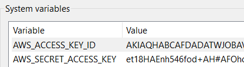

.. _mturk:

Mechanical Turk
===============

Overview
--------

oTree provides integration with Amazon Mechanical Turk (MTurk):

#.  From oTree's admin interface, you publish your session to MTurk.
#.  Workers on Mechanical Turk participate in your session.
#.  From oTree's admin interface, you send each participant their participation fee
    and bonus (payoff).

Installation
------------

.. code-block::

    pip3 install -U "otree[mturk]"

MTurk template
--------------

Put the following inside your ``mturk_template.html``:

.. code-block:: html+djang0

    

    <crowd-form>
      

        

          This HIT is an academic experiment on decision making from XYZ University....
          After completing this HIT, you will receive your reward plus a bonus payment....
        

        
After
          you have accepted this HIT, the URL to the study will appear here: <b><a class="otree-link">link</a></b>.
        

        

          On the last page, you will be given a completion code.
          Please copy/paste that code below.
        

        <crowd-input name="completion_code" label="Enter your completion code here" required></crowd-input>
         
      

    </crowd-form>

You can easily test out the appearance by putting it in an .html file on your desktop,
then double-clicking the HTML file to open it in your browser.
Modify the content inside the ``<crowd-form>`` as you wish, but make sure it has the following:

#.  The link to the study, which should look like ``<a class="otree-link">Link text</a>``.
    Once the user has accepted the assignment, oTree will automatically add the ``href`` to those links to make them point to your study.
#.  If you want the completion code to be displayed in the oTree Admin interface (Payments tab),
    you need a ``<crowd-input>`` named ``completion_code``.

Making your session work on MTurk
---------------------------------

On the last page of your study, give the user a completion code.
For example, you can simply display:
"You have completed the study. Your completion code is TRUST2020."
If you like, you can generate unique completion codes.
You don't need to worry too much about completion codes,
because oTree tracks each worker by their MTurk ID and displays that in
the admin interface and shows whether they arrived on the last page.
The completion code is just an extra layer of verification, and it gives
workers a specific objective which they are used to having.

Extra steps for non-Studio users
--------------------------------

If you are not using oTree Studio, you need to additionally follow the steps
:ref:`here <mturknostudio>`.

Local Sandbox testing
---------------------

Before launching a study, you must create an employer account with MTurk,
to get your ``AWS_ACCESS_KEY_ID`` and ``AWS_SECRET_ACCESS_KEY``.

You can obtain these credentials `here <https://console.aws.amazon.com/iam/home?#security_credential>`__:

.. figure:: _static/mturk/dNhkOiA.png
   :alt: AWS key

To test in the MTurk Sandbox locally,
and see how it will appear to workers,
you need to store these credentials onto your computer.

If using Windows, search for "environment variables" in the control panel,
and create 2 environment variables so it looks like this:

On Mac, put your credentials into your ``~/.bash_profile`` file like this::

    export AWS_ACCESS_KEY_ID=AKIASOMETHINGSOMETHING
    export AWS_SECRET_ACCESS_KEY=yoursecretaccesskeyhere

Restart your command prompt and run oTree.
From the oTree admin interface, click on "Sessions" and then,
on the button that says "Create New Session", select "For MTurk":

.. figure:: _static/mturk/create-mturk-session.png

Set environment variables on your web server
--------------------------------------------

If using Heroku, go to your App Dashboard's "settings",
and set the config vars ``AWS_ACCESS_KEY_ID`` and ``AWS_SECRET_ACCESS_KEY``.

.. _qualification-requirements:

Qualification requirements
~~~~~~~~~~~~~~~~~~~~~~~~~~

oTree uses boto3 syntax for qualification requirements.
Here is an example with 2 qualification requirements
that you can paste into your ``qualification_requirements`` setting:

.. code-block:: python

    [
        {
            'QualificationTypeId': "3AWO4KN9YO3JRSN25G0KTXS4AQW9I6",
            'Comparator': "DoesNotExist",
        },
        {
            'QualificationTypeId': "4AMO4KN9YO3JRSN25G0KTXS4AQW9I7",
            'Comparator': "DoesNotExist",
        },
    ]

Here is how you would require workers from the US.
(`00000000000000000071` is the code for a location-based qualification.)

.. code-block:: python

    [
        {
            'QualificationTypeId': "00000000000000000071",
            'Comparator': "EqualTo",
            'LocaleValues': [{'Country': "US"}]
        },
    ]

See the
`MTurk API reference <http://docs.aws.amazon.com/AWSMechTurk/latest/AWSMturkAPI/ApiReference_QualificationRequirementDataStructureArticle.html>`__.
(However, note that the code examples there are in JavaScript, so you would need
to modify the syntax to make it work in Python, e.g. adding quotes around dictionary keys.)

Note: when you are in sandbox mode, oTree ignores qualification requirements.

Preventing retakes (repeat workers)
-----------------------------------

To prevent a worker from participating twice,
you can grant a Qualification to each worker in your study,
and then block people who already have this Qualification.

Login to your MTurk requester account and create a qualification.
Go to your oTree MTurk settings and paste that qualification ID into ``grant_qualification_id``.
Then, add an entry to ``qualification_requirements``:

.. code-block:: python

        {
            'QualificationTypeId': "YOUR_QUALIFICATION_ID_HERE",
            'Comparator': "DoesNotExist",
        },

Multiplayer games & dropouts
----------------------------

Games that involve wait pages are difficult on Mechanical Turk,
because some participants
drop out or delay starting the game until some time after
accepting the assignment.

To mitigate this, see the recommendations in :ref:`wait-page-stuck`.

When you create a session with N participants
for MTurk, oTree actually creates (N x 2) participants, because spares are needed
in case some MTurk workers start but then return the assignment.

Managing your HITs
------------------

oTree provides the ability to approve/reject assignments,
send bonuses, and expire HITs early.
If you want to do anything beyond this
(e.g. extend expiration date, interact with workers,
send custom bonuses, etc), you will need to install the
`MTurk command-line tools <https://aws.amazon.com/cli/>`__
or use the 3rd party
`Manage HITs Individually <https://manage-hits-individually.s3.amazonaws.com/v4.0/index.html#/credentials>`__
tool.

Misc notes
----------

If you are publishing to MTurk using another service like TurkPrime,
you may not need to follow the steps on this page.