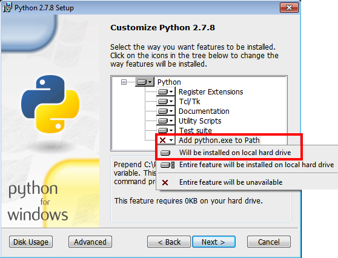

.. _python2:

Python 2.7 installation instructions
====================================

We recommend using oTree with Python 3.5, but
here are the instructions if you prefer to use Python 2.7.

.. note::

    If you use Python 2, you should use the ``pip`` command instead of ``pip3``,
    wherever mentioned in the oTree documentation.

Python 2.7 on Windows
~~~~~~~~~~~~~~~~~~~~~

Download and install `Python 2.7 <https://www.python.org/downloads/release/python-2711/>`__.
During installation, choose to customize and select to add python.exe to Path:

Once setup is done, open PowerShell and enter::

    pip -V

It will output a line that gives the version of Python at the end;
this should match the version of Python you just installed.

Python 2.7 on Mac OSX
~~~~~~~~~~~~~~~~~~~~~

Although Mac OSX comes pre-installed with Python, we recommend not using the pre-installed Python,
and instead installing Python through Homebrew.

* Open your Terminal and run:

.. code-block:: bash

    xcode-select --install

When prompted, select to install the "command line developer tools".

* Then install `Homebrew <http://brew.sh/>`__:

.. code-block:: bash

    ruby -e "$(curl -fsSL https://raw.githubusercontent.com/Homebrew/install/master/install)"

* Update your ``PATH`` variable to state that homebrew packages should be
  used before system packages::

    echo "export PATH=/usr/local/bin:/usr/local/sbin:\$PATH" >> ~/.bash_profile

* Reload ``.bash_profile`` to ensure the changes have taken place::

    source ~/.bash_profile

* Install python::

    brew install python

* Test that it's installed::

    pip -V

It will output a line that gives the version of Python at the end;
this should match the version of Python you just installed.

