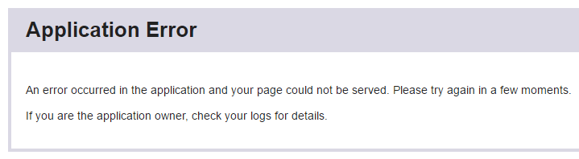

.. _heroku:

Basic Server Setup (Heroku)
===========================

`Heroku <https://www.heroku.com/>`__ is a commercial cloud hosting provider.
If you are not experienced with web server administration, Heroku may be
the simplest option for you.

The Heroku free plan is sufficient for small-scale testing of your app,
but once you are ready to launch a study, you should upgrade to a paid server,
which can handle more traffic. However, Heroku is quite inexpensive,
because you only pay for the time you actually use it.
If you run a study for only 1 day, you can turn off your dynos and addons,
and then you only pay 1/30 of the monthly cost.
Often this means you can run a study for just a few dollars.

Heroku setup (quick version)
----------------------------

Assuming Heroku is already installed & logged in::

    git init
    git add .
    git commit -am "my commit message"
    heroku create
    heroku addons:create heroku-redis:premium-0
    git push heroku master
    heroku run "otree resetdb"

Heroku setup (detailed version)
-------------------------------

Create an account
~~~~~~~~~~~~~~~~~

Create an account on `Heroku <https://www.heroku.com/>`__.
Select Python as your main language. However,
you can
skip the "Getting Started With Python" guide.

Install the Heroku Toolbelt
~~~~~~~~~~~~~~~~~~~~~~~~~~~

Install the `Heroku Toolbelt <https://toolbelt.heroku.com/>`__.

This provides you access to the Heroku Command Line utility.

Once installed open your command prompt/terminal,
and ``cd`` to your project folder.

Log in using the email address and password you used when
creating your Heroku account:

.. code-block:: bash

    $ heroku login

If the ``heroku`` command is not found,
close and reopen your command prompt.

Initialize your Git repo
~~~~~~~~~~~~~~~~~~~~~~~~

If you haven't already initialized a git repository
run this command from your project's root folder:

.. code-block:: bash

    git init

If you're on Windows, you may need to install Git manually from
`here <https://git-scm.com/download/win>`__.

Create the Heroku app
~~~~~~~~~~~~~~~~~~~~~

Create an app on Heroku, which prepares Heroku to receive your source
code:

.. code-block:: bash

    $ heroku create
    Creating lit-bastion-5032 in organization heroku... done, stack is cedar-14
    http://lit-bastion-5032.herokuapp.com/ | https://git.heroku.com/lit-bastion-5032.git
    Git remote heroku added

When you create an app, a git remote (called heroku) is also created and associated with your local git repository.

Heroku generates a random name (in this case lit-bastion-5032) for your
app. Or you can specify your own name; see ``heroku help create`` for more info.
(And see ``heroku help`` for general help.)

.. _redis:

Install Redis add-on
~~~~~~~~~~~~~~~~~~~~

Use this command to install Redis::

    heroku addons:create heroku-redis:hobby-dev

If you don't do it, you will see an "Application Error":

If Redis is not set up, you may also see messages in your ``heroku logs``
saying "Connection refused", or an error mentioning port 6379.
After adding Redis, if it's still not working,
you may need to wait for a few minutes, or restart with ``heroku restart``.

Upgrade oTree
~~~~~~~~~~~~~

Upgrade oTree, to get the latest bugfixes:

.. code-block:: bash

    $ pip3 install -U otree

.. _requirements_base.txt:

Save to requirements_base.txt
~~~~~~~~~~~~~~~~~~~~~~~~~~~~~

Run::

    otree --version

The version that is output will look something like ``X.X.X``.
Open ``requirements_base.txt`` in your project's root folder
and replace whatever is in that file with this single line::

    otree>=X.X.X

This tells Heroku which version of otree to use.

.. note::
    Change as of December 2017: if your ``requirements_base.txt`` contains
    ``Django==1.8.8``, you should delete that line.

    Also, otree-core has been renamed to otree, as described in :ref:`v20`,
    so you should replace ``otree-core`` by ``otree``.

If your code uses any extra Python packages (e.g. Numpy or Pandas),
they need to be added to your ``requirements_base.txt`` also.

Push your code to Heroku
~~~~~~~~~~~~~~~~~~~~~~~~

Commit your changes (note the dot in ``git add .``):

.. code-block:: bash

    git add .
    git commit -am "your commit message"

Transfer (push) the local repository to Heroku:

.. code-block:: bash

    git push heroku master

Reset the oTree database on Heroku.

.. code-block:: bash

    heroku run "otree resetdb"

(You can run ``heroku run "otree resetdb --noinput"`` if you want to skip
the prompt.)

Open the site in your browser:

.. code-block:: bash

    heroku open

(This command must be executed from the folder that contains your project.)

That's it! You should be able to play your app online.
If not, see the next section.

.. _heroku-troubleshooting:

Troubleshooting
~~~~~~~~~~~~~~~

If your app fails to load, e.g. "application error", try the following:

-   Use the command ``heroku logs`` to check the server logs for any error messages
    (or, better yet, enable :ref:`Papertrail <papertrail>`, which provides a nice UI for browsing logs).
-   Make sure you remembered to enable the Heroku Redis add-on (see :ref:`here <redis>`).
-   Run ``heroku run "otree --version"`` to check that you are using the latest version of otree on Heroku.

Making updates and modifications
~~~~~~~~~~~~~~~~~~~~~~~~~~~~~~~~

When you make modifications to your app and want to push the updates
to Heroku, enter::

    git add .
    git commit -am "my commit message"
    git push heroku master
    # next command only required if you added/removed a field in models.py
    heroku run "otree resetdb"

You should also regularly update your :ref:`requirements_base.txt <requirements_base.txt>`.

Further steps with Heroku
-------------------------

Below are the steps you should take before launching a real study,
or to further configure your server's behavior.

Turn on timeout worker Dyno
~~~~~~~~~~~~~~~~~~~~~~~~~~~

To enable full functionality, you should go to the `Heroku Dashboard <https://dashboard.heroku.com/apps>`__,
click on your app, click to edit the dynos, and turn on the second dyno
(named ``worker`` or ``timeoutworker``).

Turning on the second dyno is free, but you may need to register a credit card with Heroku.

If you are just testing your app, oTree will still function without the timeoutworker,
but if you are running a study with real participants and your pages have
timeouts defined by ``timeout_seconds``, then the timeoutworker will ensure
that the user will be automatically advanced to the next page
even if they closes their browser. This can be useful for online experiments
with groups.

To add an existing remote:
~~~~~~~~~~~~~~~~~~~~~~~~~~

If you previously created a Heroku app and want to link your local oTree git repository
to that app, use this command:

.. code-block:: bash

    $ heroku git:remote -a [myherokuapp]

You can get your app's name by typing ``heroku apps``.

Scaling up the server
~~~~~~~~~~~~~~~~~~~~~

The Heroku free plan is sufficient for small-scale testing of your app, but once you are ready to go live,
you need to upgrade to a paid plan.

After you finish your experiment,
you can scale your dynos and database back down,
so then you don't have to pay the full monthly cost.

Postgres (upgrade required)
'''''''''''''''''''''''''''

You need to upgrade your Postgres database to a paid tier
(at least the cheapest paid plan),
because the free version can only store a small amount of data.

To provision the "Hobby Basic" database::

    $ heroku addons:create heroku-postgresql:hobby-basic
    Adding heroku-postgresql:hobby-basic to sushi... done, v69
    Attached as HEROKU_POSTGRESQL_RED
    Database has been created and is available

This command will give you the name of your new DB (in the above example, ``HEROKU_POSTGRESQL_RED``).
Then you need to promote (i.e. "activate") this new database::

    $ heroku pg:promote HEROKU_POSTGRESQL_RED  # substitute your color here
    Promoting HEROKU_POSTGRESQL_RED_URL to DATABASE_URL... done

More info on the database plans `here <https://elements.heroku.com/addons/heroku-postgresql>`__,
and more technical documentation `here <https://devcenter.heroku.com/articles/heroku-postgresql>`__.

After purchasing the upgraded Postgres, it's recommended to delete the hobby-dev
(free) database, to avoid accidentally using the wrong database.

Upgrade dynos
'''''''''''''

In the Heroku dashboard, click on your app's "Resources" tab,
and in the "dynos" section, select "Upgrade to Hobby".
Then select either "Hobby" or "Professional".

You can also increase the number of web dynos,
but if you do so, you may need to upgrade your Redis plan also,
because more dynos means more Redis connections.

You should not increase the number of timeoutworker dynos.

Upgrade Redis
+++++++++++++

If running a study, you should upgrade to one of the paid Redis plans,
because it allows more connections and gives you more memory,
which can prevent the following errors:

-   "ConnectionError: max number of clients reached"
-   "ResponseError: OOM command not allowed when used memory > 'maxmemory'."

Setting environment variables
~~~~~~~~~~~~~~~~~~~~~~~~~~~~~

If you would like to turn off debug mode, you should set the ``OTREE_PRODUCTION``
environment variable, like this:

.. code-block:: bash

    $ heroku config:set OTREE_PRODUCTION=1

However, this will hide error pages, so you should set up :ref:`sentry`.

To password protect parts of the admin interface,
you should set ``OTREE_AUTH_LEVEL``):

.. code-block:: bash

    $ heroku config:set OTREE_AUTH_LEVEL=DEMO

More info at :ref:`AUTH_LEVEL`.

.. _papertrail:

Logging with Papertrail
-----------------------

If using Heroku, we recommend installing the free "Papertrail" logging add-on::

    heroku addons:create papertrail:choklad

Papertrail gives you an easy-to-use interface for exploring the Heroku server logs.
It is much easier to use than running ``heroku logs``.

(This is useful even if you are already using Sentry, because it shows different types of errors.)

Database backups
----------------

When running studies, it is your responsibility to back up your database.

In Heroku, you can set backups for your Postgres database. Go to your `Heroku Dashboard <https://dashboard.heroku.com/apps/>`__,
click on the "Heroku Postgres" tab, and then click "PG Backups".
More information is available `here <https://devcenter.heroku.com/articles/heroku-postgres-backups>`__.

Next steps
----------

See :ref:`server_final_steps` for steps you should take before launching your study.
