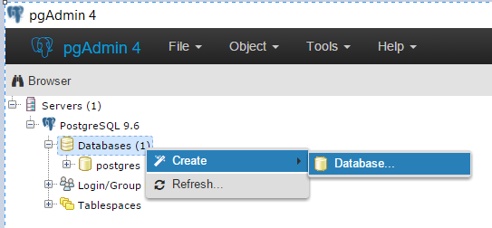

.. _install-windows:

Windows Server
==============

If you are just testing your app on your personal computer, you can use
``otree runserver``. You don't need a full server setup as described below,
which is necessary for sharing your app with an audience.

Upgrade oTree
~~~~~~~~~~~~~

Upgrade oTree, to get the latest bugfixes:

.. code-block:: bash

    $ pip3 install -U otree-core

Database (Postgres)
-------------------

oTree's default database is SQLite, which is fine for local development,
but insufficient for production, because it often locks when it multiple
clients are accessing it.

We recommend you use PostgreSQL,
although in principle you can also use MySQL, MariaDB, or any other database
supported by Django.

Install `Postgres for Windows <http://www.enterprisedb.com/products-services-training/pgdownload#windows>`__,
using the default options. Note down the password you chose for the root ``postgres`` user.

Launch pgAdmin (you can find it in your Windows Start menu),
and using the browser, create a new database:

In the "Database" field, enter the name ``django_db``.

Now, edit your ``pg_hba.conf``, which is usually located in ``C:\Program Files\PostgreSQL\9.6\data``
or a similarly named folder. On the lines for ``IPv4`` and ``IPv6``, change
the ``METHOD`` from ``md5`` to ``trust``.

Setting DATABASE_URL (if running the server on your laptop)
~~~~~~~~~~~~~~~~~~~~~~~~~~~~~~~~~~~~~~~~~~~~~~~~~~~~~~~~~~~

Now you should tell oTree to use Postgres instead of SQLite.
The default database configuration in ``settings.py`` is::

    DATABASES = {
        'default': dj_database_url.config(
            default='sqlite:///' + os.path.join(BASE_DIR, 'db.sqlite3')
        )
    }

If you're using your PC as the server,
you can add this line above the line with ``DATABASES``,
to simulate setting the env var ``DATABASE_URL``::

    environ['DATABASE_URL'] = 'postgres://postgres@localhost/django_db'

Setting DATABASE_URL (if running on a dedicated server)
~~~~~~~~~~~~~~~~~~~~~~~~~~~~~~~~~~~~~~~~~~~~~~~~~~~~~~~

On the other hand, if your server is a separate machine from your development PC,
it's better to instead set the ``DATABASE_URL`` environment variable on your server.
Setting the database through an environment variable
allows you to continue to use SQLite on your development machine,
while using Postgres on your production server.

Set your ``DATABASE_URL`` to this::

    postgres://postgres@localhost/django_db

To set the environment variable, do a Windows search (or control panel search)
for "environment variables". This will take you to the dialog with a name like
"Edit system environment variables". Add a new system entry for ``DATABASE_URL`` with the above URL.

Then restart PowerShell so the environment variable gets loaded.

Once ``DATABASE_URL`` is defined, oTree will use it instead of the default SQLite.
(This is done via `dj_database_url <https://pypi.python.org/pypi/dj-database-url>`__.)

While you're editing environment variables, you can also set other environment variables like

psycopg2
~~~~~~~~

To use Postgres, you need to install psycopg2 with ``pip3 install psycopg2``.
If the pip install doesn't work,
download it `here <http://www.stickpeople.com/projects/python/win-psycopg/>`__.
(If you are using a virtualenv, note the special installation instructions on that page.)

resetdb
~~~~~~~

If all the above steps went well, you should be able to run ``otree resetdb``.

.. _redis-windows:

Install Redis
-------------

You should download and run `Redis for Windows <https://github.com/MSOpenTech/redis/releases>`__.

Redis should be running on port 6379. You can test with ``redis-cli ping``,
which should output ``PONG``.

Run the production server
-------------------------

Run::

    otree runprodserver --port=80

See :ref:`here <runprodserver>` for full instructions.
The steps are essentially the same as on Linux.

Set environment variables
-------------------------

Now let's set the variables that control security.

If you're using your own PC as a server,
the simplest way is to just set them in in your ``settings.py``, e.g.:

.. code-block:: python

    ADMIN_PASSWORD = 'my_password'
    OTREE_PRODUCTION = '0'
    OTREE_AUTH_LEVEL = 'DEMO'

However, if using a dedicated server, it's best practice to use
environment variables; you should set ``OTREE_ADMIN_PASSWORD``,
``OTREE_PRODUCTION``, and ``OTREE_AUTH_LEVEL``.

Allow other computers to connect
--------------------------------

See instructions :ref:`here <server-adhoc>`.

Next steps
----------

See :ref:`server_final_steps` for steps you should take before launching your study.

Advanced
--------

(Optional) create a virtualenv
~~~~~~~~~~~~~~~~~~~~~~~~~~~~~~

It's a best practice to use a virtualenv (though optional)::

    python3 -m venv venv_otree

You can configure PowerShell to always activate this virtualenv.
Enter::

    notepad $shell

Then put this in the file::

    cd "C:\path\to\oTree"
    . "C:\path\to\oTree\venv_otree\Scripts\activate.ps1"

(Note the dot at the beginning of the line.)

(Optional) use git
~~~~~~~~~~~~~~~~~~

The remaining steps are to deploy your code with Git as described :ref:`here <git-generic>`,
