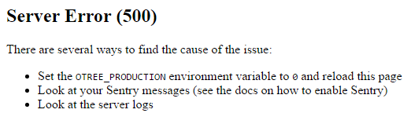

.. _server_final_steps:

Server deployment: final steps
==============================

Look at your server check
-------------------------

In the oTree admin interface, click "Server Check" in the header bar.
It will tell you what steps below you need to take.

Testing with browser bots
-------------------------

Before launching a study, it's advisable to test your apps with bots,
especially browser bots. See the section :ref:`bots`.

.. _sentry:

Logging with Sentry
-------------------

Whether or not you use Heroku,
you should enter your email address (`here <https://docs.google.com/forms/d/1aro9cL4smi1jbyFM--CqsJpr2oRHjNCE-UVHZEYHQcE/viewform>`__)
to sign up for our free Sentry service
which can log all errors on your server and send you email notifications.
(`Sentry <https://getsentry.com/welcome/>`__.)

Sentry is necessary because many errors are not visible in the UI after you turn off debug mode.
You will no longer see Django's yellow error pages;
you or your users will just see generic "500 server error" pages:

After you enter your email, you will receive an email with information
on how to activate Sentry in your project.

Contact us!
-----------

We are very interested to learn what experiments people are running with oTree.
Having "case studies" is very important for things like getting
funding so we can continue developing oTree.

Also, hearing from oTree users motivates us to continue oTree development,
and helps us understand better how people use oTree,

Send an email to chris@otree.org to let us know about your study,
and any information like what challenges you faced, etc.
We might also mention your study on `otree.org <http://www.otree.org/>`__.

Modifying an existing database
------------------------------

.. note::

    Migrations are being removed from otree-core

.. note::

    If you are getting errors related to migrations, like
    "django.db.migrations.graph.NodeNotFoundError: Migration my_app.0001_initial dependencies
    reference nonexistent parent node", you can make the problem go away by
    just deleting ``my_app/migrations``.

This section is more advanced and is for people who are comfortable with troubleshooting.

If your database already contains data and you want to update the structure
without running ``resetdb`` (which will delete existing data), you can use Django's migrations feature.
Below is a quick summary; for full info see the Django docs `here <https://docs.djangoproject.com/en/1.9/topics/migrations/#workflow>`__.

First, add the following line to settings.py::

    MIGRATION_MODULES = {'otree': 'otree_core_migrations'}

Then run::

    python manage.py makemigrations otree

Then run ``python manage.py makemigrations my_app_name`` (substituting your app's name),
for each app you are working on. This will create a ``migrations`` directory in your app,
which you should add to your git repo, commit, and push to your server.

Instead of using ``otree resetdb`` on the server, run ``python manage.py migrate`` (or ``otree migrate``).
If using Heroku, you would do ``heroku run otree migrate``.
This will update your database tables.

If you get an error ``NameError: name 'Currency' is not defined``,
you need to find the offending file in your app's ``migrations`` folder,
and add ``from otree.api import Currency`` at the top of the file.

If you make further modifications to your apps or upgrade otree-core, you can run
``python manage.py makemigrations``. You don't need to specify the app names in this command;
migrations will be updated for every app that has a ``migrations`` directory.
Then commit, push, and run ``python manage.py migrate`` again as described above.

More info `here <https://docs.djangoproject.com/en/1.9/topics/migrations/#workflow>`__

Migrations removed from otree-core
~~~~~~~~~~~~~~~~~~~~~~~~~~~~~~~~~~

As of September 2017, migrations are being removed from otree-core,
because they complicate oTree's development process and are only used by a small
number of people.

If you have been using migrations with previous releases of otree-core
and you want to continue using migrations, you should follow these steps:

-   Before upgrading otree-core, note the version of otree-core you are using,
    find the migrations folder from ``otree-core``.
    If you can't find the migrations folder in your system Python installation,
    you can way to find the right migrations folder on GitHub.
    Go `here <https://github.com/oTree-org/otree-core/tree/1.3.9/otree>`__,
    and change the "tag" to whatever version of otree-core you are using.
-   Copy the folder ``migrations`` into your project. You can rename it to
    ``otree_core_migrations`` for clarity.
-   Add to your settings.py: ``MIGRATION_MODULES = {'otree': 'otree_core_migrations'}``
-   Upgrade otree-core
-   Run ``python manage.py makemigrations`` and ``python manage.py migrate``
    as you did before.
