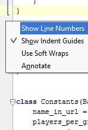

.. _setup:

Download & Setup
================

Command line basics
-------------------

To use oTree, you need to use PowerShell (Windows) or Terminal (Mac).
In this documentation, we refer to these programs as your "command prompt" or "command line".
Sometimes, we write a command prefixed with a ``$`` like this::

    $ otree resetdb

The ``$`` is not part of the command. You can copy the command (in this example, ``otree resetdb``),
and then paste it at your command line. (In PowerShell, you should right-click to paste.)

A few tips:

* You can retrieve the previous command you entered by pressing your keyboard's "up" arrow
* If you get stuck running a command, you can press ``Control + C``.

Install Python
--------------

We recommend installing Python 3.5, because oTree is primarily developed and
tested on Python 3.5.

oTree should also work on Python 2.7 (see :ref:`python2`), but we will discontinue
Python 2 support eventually. If you already created an oTree project
with Python 2 and would like to switch to Python 3,
follow the instructions :ref:`here <py3-migration>`.

If you already have Python 3.5 installed
(check by entering ``pip3 -V`` at your command prompt),
you can skip the below section. Or, uninstall your existing version of Python,
and proceed with the below steps.

Install Python 3.5 (Windows)
~~~~~~~~~~~~~~~~~~~~~~~~~~~~

Download and install `Python 3.5 <https://www.python.org/downloads/release/python-351/>`__.
Check the box to add Python to PATH:

.. figure:: _static/setup/py-win-installer.png

Once setup is done, open PowerShell and enter::

    pip3 -V

It will output a line that gives the version of Python at the end;
this should match the version of Python you just installed.

Install Python 3.5 (Mac OSX)
~~~~~~~~~~~~~~~~~~~~~~~~~~~~

Although Mac OSX comes pre-installed with Python, we recommend not using the pre-installed Python,
and instead installing Python through Homebrew.
However, if you already have Python 3.5 or 2.7 installed through Conda, that should be OK.
To install Python 3 via Homebrew:

* Open your Terminal and run:

.. code-block:: bash

    xcode-select --install

When prompted, select to install the "command line developer tools".

* Then install `Homebrew <http://brew.sh/>`__:

.. code-block:: bash

    ruby -e "$(curl -fsSL https://raw.githubusercontent.com/Homebrew/install/master/install)"

* Update your ``PATH`` variable to state that homebrew packages should be
  used before system packages::

    echo "export PATH=/usr/local/bin:/usr/local/sbin:\$PATH" >> ~/.bash_profile

* Reload ``.bash_profile`` to ensure the changes have taken place::

    source ~/.bash_profile

* Install python::

    brew install python3

* Then test that it worked::

    pip3 -V

It will output a line that gives the version of Python at the end;
this should match the version of Python you just installed.

Install Python (Linux/UNIX)
~~~~~~~~~~~~~~~~~~~~~~~~~~~

We recommmend installing using your system's package manager to install Python 3.5.
If you use the default system Python 2.7 installation,
we recommend running ``pip install --upgrade pip``,
because the default system Python can have an outdated version of Pip.
If ``Twisted`` fails to compile, install the ``python-dev`` package (e.g. through ``apt-get``).

More information in the :ref:`Linux server setup <server-ubuntu>` section.

Install oTree
~~~~~~~~~~~~~

.. code-block:: bash

    pip3 install --upgrade otree-core

Windows issue: vcvarsall.bat and Visual C++
^^^^^^^^^^^^^^^^^^^^^^^^^^^^^^^^^^^^^^^^^^^

On Windows you might see an error like this about Twisted and ``vcvarsall.bat``::

    error: Microsoft Visual C++ 9.0 is required (Unable to find vcvarsall.bat). Get it from http://aka.ms/vcpython27

-   Python 3.5: install the `Visual C++ Build Tools <http://go.microsoft.com/fwlink/?LinkId=691126>`__.
-   Python 2.7: install `this <http://aka.ms/vcpython27>`__.

Running oTree
~~~~~~~~~~~~~

Open PowerShell (on Windows) or Terminal (on Mac OS X), and ``cd`` to the directory where you want to store your oTree code (such as ``Documents``).

Run::

    otree startproject oTree

If it's your first time, we recommend choosing the option to include the sample games.

Then change to the directory you just created:

.. code-block:: bash

    cd oTree

Reset the database::

    otree resetdb

(You might see a message about migrations; you can ignore that.)

Then run the server::

    otree runserver

Then open your browser to `http://127.0.0.1:8000/ <http://127.0.0.1:8000/>`__.
You should see the oTree demo site.

To stop the server, enter ``Control + C`` at your command line.
To restart the server from the command line, pressing your keyboard's "up" arrow (this will retrieve the last command you entered),
and hit Enter.

.. _pycharm:

Installing a Python editor (PyCharm)
------------------------------------

You should install a text editor for writing your Python code.

We recommend using `PyCharm <https://www.jetbrains.com/pycharm/download/>`__.
Professional Editon is better than Community Edition because it has Django support.
PyCharm Professional is free if you are a student, teacher, or professor.

(If you prefer another editor like Notepad++, TextWrangler, or Sublime Text, you can use that instead.)

Launch PyCharm, go to "File -> Open..." and select the folder you created with ``otree startproject``.

Then click on ``File –> Settings`` (or ``Default Settings``) and navigate to ``Languages & Frameworks -> Django``,
check "Enable Django Support" and set your oTree folder as the Django project root,
with your ``manage.py` and ``settings.py``.

Open a file, right-click on the left margin, and select "Show line numbers":

If PyCharm displays this warning, select "Ignore requirements":

.. figure:: _static/setup/pycharm-psycopg2-warning.png

A guide on how to properly setup PyCharm to work with oTree on Windows written by Jan Vávra can be found `here <http://janvavra.github.io/>`__. 

.. _upgrade:

Upgrading/reinstalling oTree
----------------------------

The oTree software has two components:

-  oTree-core: The engine that makes your apps run
-  oTree library: the folder of sample games and other files (e.g. settings.py) that you download from `here <https://github.com/oTree-org/oTree>`__ and customize to build your own project.

.. _upgrade-otree-core:

Upgrade oTree core
~~~~~~~~~~~~~~~~~~

We recommend you do this on a weekly basis,
so that you can get the latest bug fixes and features.
This will also ensure that you are using a version that is consistent with the current documentation.

Run:

.. code-block:: bash

    pip3 install --upgrade otree-core
    otree resetdb

Upgrade oTree library
~~~~~~~~~~~~~~~~~~~~~

Run ``otree startproject [folder name]``. This will create a folder with the specified name and
download the latest version of the library there.

If you originally installed oTree over 5 months ago,
we recommend you run the above command and move your existing apps into the new project folder,
to ensure you have the latest ``settings.py``, etc.
