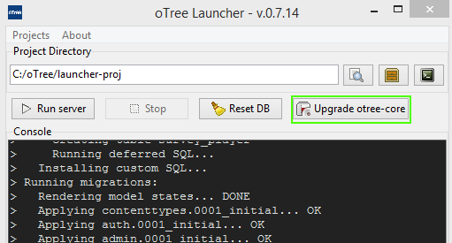

.. _setup:

Download & Setup
================

There are two ways to install oTree that you can choose from:

*   The "launcher install" provides a graphical interface for running the oTree
    server. It also provides a command line interface.
*   The "plain install" only lets you run oTree from the command line.

If you encounter any error during installation, please email chris@otree.org
with the error message.

Prerequisite: Python 2.7 (not 3.x)
----------------------------------

*   On Windows: download and install
    `Python 2.7 <https://www.python.org/downloads/>`__. (oTree does not work with Python 3.)
    Then add Python to
    your ``Path`` environment variable:

    *   Open the Windows Start menu
    *   Search for "Edit the system environment variables", and then click it.
    *   Click ``Environment Variables``
    *   Select ``Path`` in the ``System variables`` section
    *   Click ``Edit``
    *   Add ``;C:\Python27;C:\Python27\Scripts`` to the end of the list
        (the paths are separated by semicolons). For example:
        ``C:\Windows;C:\Windows\System32;C:\Python27;C:\Python27\Scripts``
    *   (This assumes that Python was installed to ``C:\Python27``.)

*   On Mac/Unix, it is very likely that Python is already installed. You can
    check by opening the Terminal and writing ``python`` and hit Enter.

    If you get something like ``-bash: python: command not found`` you
    will have to install it yourself.

.. note::

    **Windows/Mac:** Verify that it worked by opening your command prompt and
    entering ``python``. You should see the "``>>>``" prompt.

Launcher install
----------------

-   Download the launcher from this link:

    .. only:: html

        .. raw:: html

            

                
            

    .. only:: not html

        `oTree_launcher-stable.zip <https://github.com/oTree-org/otree-launcher/archive/master.zip>`_

-   Unzip it to an easy-to-access location, like your "Documents" folder.
-   Run ``otree.py``.
-   Initial setup may take 5-10 minutes.
-   When the app window launches, click the buttons to create a new deploy and
    choose a location to store your project files.
-   Click the "run server" button
-   Note: the oTree launcher is not installed as an app in your Windows start
    menu or Mac Applications. To reopen the launcher, simply double click
    otree.py again.

.. note::

    For ``virtualenv`` users: ``otree.py`` cannot be executed inside a ``virtualenv``.
    You should execute it with a regular non-virtualenv
    python. When it is first executed, it will create a new virtualenv and install all its dependencies there.

Plain install
-------------

This is an alternative to the "launcher install".

*   From your command line, run the command ``pip`` to check if Pip is installed.
    If not, you can download it
    `here <https://pip.pypa.io/en/latest/installing.html>`__.
*   Download `oTree <https://github.com/oTree-org/oTree/archive/master.zip>`__
    and unzip it to a convenient location (such as your "Documents" folder).
    (Or better yet, use Git to clone
    `this repo <https://github.com/oTree-org/otree>`__.)
*   In your command line, go to the root directory of the unzipped folder
    where ``requirements_base.txt`` is

    .. note::

        if you cannot find ``requirements_base.txt``
        make sure you have downloaded ``oTree-master.zip``, not
        ``otree-launcher-master.zip``, which is a different download.

*   Run these commands (you may need administrator permissions):

.. code-block:: bash

    $ pip install -r requirements_base.txt

On Mac, you may need to use ``sudo``:

.. code-block:: bash

    $ sudo pip install -r requirements_base.txt

(Or you can use a ``virtualenv`` if you are familiar with that.)

Then run:

.. code-block:: bash

    $ otree resetdb
    $ otree runserver

Explanation: oTree & Django
---------------------------

oTree is built on top of Django.

The ``oTree`` folder is a Django project, as explained
`here <https://docs.djangoproject.com/en/1.8/intro/tutorial01/#creating-a-project>`__.

It comes pre-configured with all the files,
settings and dependencies so that it works right away.
You should create your apps inside this folder.

If you want, you can delete all the existing example games
(like ``asset_market``, ``bargaining``, etc).
Just delete the folders and the corresponding entries in ``SESSION_CONFIGS``.
Just keep the directories ``_static`` and ``_templates``.

When you install oTree (either using the launcher or running
``pip install -r requirements_base.txt``),
``otree-core`` gets automatically installed as a dependency.

.. _upgrade:

Upgrading/reinstalling oTree
----------------------------

The oTree software has three components:

-  oTree-core: The engine that makes your apps run
-  oTree Launcher: the graphical user interface for installing oTree and running the server
-  oTree library: the folder of sample games and other files
(e.g. settings.py) that you download from [here](https://github.com/oTree-org/oTree) and customize to build your own project.

You can either upgrade these components individually,
or do a complete reinstallation to upgrade all of them at once.
If you originally installed oTree over 2 months ago,
we recommend a complete reinstallation,
to get all the latest features and bug fixes.

.. _upgrade-otree-core:

Upgrade oTree core libraries
~~~~~~~~~~~~~~~~~~~~~~~~~~~~

In the launcher, click "Upgrade otree-core" (or "Version select"):

Then select the most recent version in the menu.
We recommend you do this on a weekly basis,
so that you can get the latest bug fixes and features.
This will also ensure that you are using a version that is consistent with the current documentation.

If you are using the "plain install", change the ``otree-core`` version number
in ``requirements_base.txt`` and then run:

.. code-block:: bash

    $ pip install -r requirements_base.txt

Complete reinstallation
~~~~~~~~~~~~~~~~~~~~~~~

-  On Windows: In Windows Explorer's address bar, type ``%APPDATA%`` and hit enter.
   Then delete the folder ``otree-launcher``
-  On Mac/Linux: Delete the folder ``~/.config/.otree-launcher``
-  Re-download and install the launcher
-  When installation is complete, select an empty folder for your new project.
