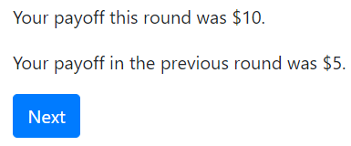
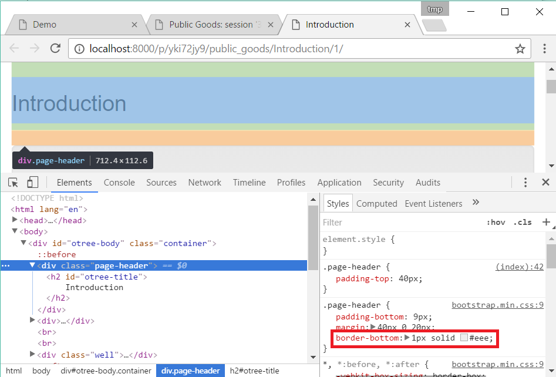

.. _templates:

Templates
=========

Template syntax
---------------

Variables
~~~~~~~~~

You can display a variable like this:

.. code-block:: django

     Your payoff is {{ player.payoff }}.

The following variables are available in templates:

-   ``player``: the player currently viewing the page
-   ``group``: the group the current player belongs to
-   ``subsession``: the subsession the current player belongs to
-   ``participant``: the participant the current player belongs to
-   ``session``: the current session
-   ``Constants``
-   Any variables you passed with :ref:`vars_for_template`.

Conditions ("if")
~~~~~~~~~~~~~~~~~

.. code-block:: django

     you won! 

With an 'else':

.. code-block:: django

    
        positive
    
        negative
    

Loops ("for")
~~~~~~~~~~~~~

.. code-block:: django

    
        {{ item }}
    

Accessing items in a dict
~~~~~~~~~~~~~~~~~~~~~~~~~

Whereas in Python code you do ``my_dict['foo']``,
in a template you would do ``{{ my_dict.foo }}``.

Comments
~~~~~~~~

.. code-block:: django

    
    this is a comment
    

Things you can't do
~~~~~~~~~~~~~~~~~~~

The template language is just for displaying values.
You can't do math (``+``, ``*``, ``/``, ``-``)
or otherwise modify numbers, lists, strings, etc.
For that, you should use :ref:`vars_for_template`.

How templates work: an example
------------------------------

oTree templates are a mix of 2 languages:

-   *HTML* (which uses angle brackets like ``<this>`` and ``</this>``.
-   *Template tags*
    (which use curly braces like ```` and ``{{ this }}``

In this example, let's say your template looks like this:

.. code-block:: html

    
Your payoff this round was {{ player.payoff }}.

    
        

            Your payoff in the previous round was {{ last_round_payoff }}.
        

    

    

Step 1: oTree scans template tags, produces HTML (a.k.a. "server side")
~~~~~~~~~~~~~~~~~~~~~~~~~~~~~~~~~~~~~~~~~~~~~~~~~~~~~~~~~~~~~~~~~~~~~~~

oTree uses the current values of the variables
to convert the above template tags to
plain HTML, like this:

.. code-block:: html

    
Your payoff this round was $10.

        

            Your payoff in the previous round was $5.
        

    <button class="otree-btn-next btn btn-primary">Next</button>

Step 2: Browser scans HTML tags, produces a webpage (a.k.a. "client side")
~~~~~~~~~~~~~~~~~~~~~~~~~~~~~~~~~~~~~~~~~~~~~~~~~~~~~~~~~~~~~~~~~~~~~~~~~~

The oTree server then sends this HTML to the user's computer,
where their web browser can read the code and display it
as a formatted web page:

Note that the browser never sees the template tags.

The key point
~~~~~~~~~~~~~

If one of your pages doesn't look the way you want,
you can isolate which of the above steps went wrong.
In your browser, right-click and "view source".
(Note: "view source" may not work in split-screen mode.)

You can then see the pure
HTML that was generated (along with any JavaScript or CSS).

-   If the HTML code doesn't look the way you expect, then something
    went wrong on the server side. Look for mistakes in your ``vars_for_template``
    or your template tags.
-   If there was no error in generating the HTML code,
    then it is probably an issue with how you are using
    HTML (or JavaScript) syntax.
    Try pasting the problematic part of the HTML back into a template,
    without the template tags, and edit it until it produces the right output.
    Then put the template tags back in, to make it dynamic again.

Images (static files)
---------------------

The simplest way to include images, video, 3rd party JS/CSS libraries, and other static files in your project is to
host them online, for example on Dropbox, Imgur, YouTube, etc.

Then, put its URL in an  or <video> tag in your template, for example:

.. code-block:: html

    

You can also store images directly in your project.
(but note that large file sizes can affect performance).
oTree Studio has an image upload tool.
(If you are using a text editor, see :ref:`here <staticfiles>`.)
Once you have stored the image, you can display it like this:

.. code-block:: html

    

Dynamic images
~~~~~~~~~~~~~~

If you need to show different images depending on the context
(like showing a different image each round),
you can construct it in ``vars_for_template`` and pass it to the template, e.g.:

.. code-block:: python

    class MyPage(Page):

        def vars_for_template(self):
            return dict(
                image_path='my_app/{}.png'.format(self.round_number)
            )

Then in the template:

.. code-block:: html

    

Includable templates
--------------------

If you are copy-pasting the same content across many templates,
it's better to create an includable template and reuse it with
````.

For example, if your game has instructions that need to be repeated on every page,
make a template called ``instructions.html``, and put the instructions there,
for example:

.. code-block:: html

    

    

        

        <h3>
            Instructions
        </h3>
        

            These are the instructions for the game....
        

        

    

If you are using oTree Studio, click the button to include a template.
Otherwise, create the file in your ``templates`` folder,
and see the sample games for examples of how to include the template (e.g. ``instructions_template``).

JavaScript and CSS
------------------

Where to put JavaScript/CSS code
~~~~~~~~~~~~~~~~~~~~~~~~~~~~~~~~

You can put JavaScript and CSS anywhere just by using the usual
```` or ````, anywhere in your template.

If you have a lot of scripts/styles,
you can put them in separate blocks outside of ``content``: ``scripts`` and ``styles``.
It's not mandatory to do this, but: it keeps your code organized and ensures that things are loaded in the correct order
(CSS, then your page content, then JavaScript).

.. _selectors:

Customizing the theme
~~~~~~~~~~~~~~~~~~~~~

If you want to customize the appearance of an oTree element,
here is the list of CSS selectors:

=========================   =====================================================
Element                     CSS/jQuery selector
=========================   =====================================================
Page body                   ``.otree-body``
Page title                  ``.otree-title``
Wait page (entire dialog)   ``.otree-wait-page``
Wait page dialog title      ``.otree-wait-page__title`` (note: ``__``, not ``_``)
Wait page dialog body       ``.otree-wait-page__body``
Timer                       ``.otree-timer``
Next button                 ``.otree-btn-next``
Form errors alert           ``.otree-form-errors``
=========================   =====================================================

For example, to change the page width, put CSS in your base template like this:

.. code-block:: HTML

    

To get more info, in your browser, right-click the element you want to modify and select
"Inspect". Then you can navigate to see the different elements and
try modifying their styles:

When possible, use one of the official selectors above.
Don't use any selector that starts with ``_otree``, and don't select based on Bootstrap classes like
``btn-primary`` or ``card``, because those are unstable.

.. _json:
.. _js_vars:

Passing data from Python to JavaScript (js_vars)
~~~~~~~~~~~~~~~~~~~~~~~~~~~~~~~~~~~~~~~~~~~~~~~~

To pass data to JavaScript code in your template,
define a method ``js_vars`` on your Page, for example:

.. code-block:: html

    def js_vars(self):
        return dict(
            payoff=self.player.payoff,
        )

Then, in your template, you can refer to these variables:

.. code-block:: html

    

(An alternative is to use the ``|json`` filter in the template,
e.g. ``let x = {{ player.payoff|json }};``, but ``js_vars`` is simpler.

Bootstrap
---------

oTree comes with `Bootstrap <https://getbootstrap.com/docs/5.0/components/alerts/>`__, a
popular library for customizing a website's user interface.

You can use it if you want a `custom style <http://getbootstrap.com/css/>`__, or
a `specific component <http://getbootstrap.com/components/>`__ like a table,
alert, progress bar, label, etc. You can even make your page dynamic with
elements like `popovers <https://getbootstrap.com/docs/5.0/components/popovers/>`__,
`modals <https://getbootstrap.com/docs/5.0/components/modal/>`__, and
`collapsible text <https://getbootstrap.com/docs/5.0/components/collapse/>`__.

To use Bootstrap, usually you add a ``class=`` attribute to your HTML
element.

For example, the following HTML will create a "Success" alert:

.. code-block:: HTML

        
Great job!

Mobile devices
~~~~~~~~~~~~~~

Bootstrap tries to show a "mobile friendly" version
when viewed on a smartphone or tablet.

Charts
------

You can use any HTML/JavaScript library for adding charts to your app.
A good option is `HighCharts <http://www.highcharts.com/demo>`__,
to draw pie charts, line graphs, bar charts, time series, etc.

First, include the HighCharts JavaScript::

    

Go to the HighCharts `demo site <http://www.highcharts.com/demo>`__
and find the chart type that you want to make.
Then click "edit in JSFiddle" to edit it to your liking,
using hardcoded data.

Then, copy-paste the JS and HTML into your template,
and load the page. If you don't see your chart, it may be because
your HTML is missing the ``
`` that your JS code is trying to insert the chart
into.

Once your chart is loading properly, you can replace the hardcoded data
like ``series`` and ``categories`` with dynamically generated variables.

For example, change this::

    series: [{
        name: 'Tokyo',
        data: [7.0, 6.9, 9.5, 14.5, 18.2, 21.5, 25.2, 26.5, 23.3, 18.3, 13.9, 9.6]
    }, {
        name: 'New York',
        data: [-0.2, 0.8, 5.7, 11.3, 17.0, 22.0, 24.8, 24.1, 20.1, 14.1, 8.6, 2.5]
    }]

To this::

    series: js_vars.highcharts_series

...where ``highcharts_series`` is a variable you defined in :ref:`js_vars <js_vars>`.

If your chart is not loading, click "View Source" in your browser
and check if there is something wrong with the data you dynamically generated.
