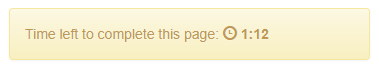

.. _timeouts:

Timeouts
========

Basics
------

You can configure time limits on your pages by using the below
attributes on your ``Page`` classes in ``views.py``.

.. _timeout_seconds:

timeout_seconds
~~~~~~~~~~~~~~~

To set a time limit on your page, add ``timeout_seconds`` like this:

.. code-block:: python

    class Page1(Page):
        timeout_seconds = 60

After the time runs out, the page auto-submits.

Example: ``timeout_seconds = 20``

When there are 60 seconds left, the page displays a timer warning the participant.

.. note::

    If you are running the production server (``runprodserver``)
    or using ``timeoutworker``,
    the page will always submit, even if the user closes their browser window.
    However, this does not occur if you are running the test server
    (``runserver``).

If you need the timeout to be dynamically determined, use :ref:`get_timeout_seconds`.

.. _timeout_happened:

timeout_happened
~~~~~~~~~~~~~~~~

This attribute is automatically set to ``True``
if the page was submitted by timeout.
It can be accessed in ``before_next_page``.
For example:

.. code-block:: python

    class Page1(Page):
        timeout_seconds = 60

        def before_next_page(self):
            if self.timeout_happened:
                self.player.my_random_variable = random.random()

``timeout_happened`` is undefined in other methods like ``vars_for_template``,
because the timeout countdown only starts after the page is rendered.

.. _timeout_submission:

timeout_submission
~~~~~~~~~~~~~~~~~~

You can use ``timeout_submission`` to define what values
should be submitted for a page if a timeout occurs,
or if the experimenter moves the
participant forward.

Example:

.. code-block:: python

    class Page1(Page):
        form_model = models.Player
        form_fields = ['accept']

        timeout_seconds = 60
        timeout_submission = {'accept': True}

If omitted, then oTree will default to
``0`` for numeric fields, ``False`` for boolean fields, and the empty
string ``''`` for text/character fields.

If the values submitted ``timeout_submission`` need to be computed dynamically,
you can check :ref:`timeout_happened` and set the values in ``before_next_page``.

.. _get_timeout_seconds:

get_timeout_seconds
~~~~~~~~~~~~~~~~~~~

.. note::

    This is a new feature in otree-core 1.3 (May 2017).

This is a dynamic alternative to ``timeout_seconds``,
so that you can base the timeout on ``self.player``, ``self.session``, etc.:

For example, you can make the timeout for a page configurable by adding a parameter
to the session config (see :ref:`edit_config`) and referencing it in your page.
In ``settings.py`` add this:

.. code-block:: python

    SESSION_CONFIGS = [
        {
            'name': 'my_app',
            'num_demo_participants': 1,
            'app_sequence': ['my_app'],
            'my_page_timeout_seconds': 60,
        },
        # etc...
    ]

    class MyPage(Page):

        def get_timeout_seconds(self):
            return self.session.config['my_page_timeout_seconds']

Advanced techniques
-------------------

.. _timeout_form:

Forms submitted by timeout
~~~~~~~~~~~~~~~~~~~~~~~~~~

If a form is auto-submitted because of a timeout,
oTree will try to save whichever fields were filled out at the time of submission.
If a field in the form contains an error (i.e. blank or invalid value),
oTree will use that field's entry according to :ref:`timeout_submission`.
If the ``error_message()`` method fails, then the whole form might be invalid,
so the whole form will be discarded and :ref:`timeout_submission`
will be used instead.

If you want to discard the auto-submitted form, you can just
set the values in ``before_next_page``, which will overwrite the data from the form.
Assuming you have defined ``timeout_submission``, you can write this:

    .. code-block:: python

        def before_next_page(self):
            if self.timeout_happened:
                for field_name, value in self.timeout_submission:
                    setattr(self.player, field_name, value)

Timeouts that span multiple pages
~~~~~~~~~~~~~~~~~~~~~~~~~~~~~~~~~

You can use ``get_timeout_seconds`` to create timeouts that span multiple
pages, or even the entire session. The trick is to define a fixed "expiration time",
and then on each page, make ``get_timeout_seconds`` return the number of seconds
until that expiration time.

First, choose a place to start the timer. This could be a page called
"Start" that displays text like "Press the button when you're ready to start".
When the user clicks the "next" button, ``before_next_page`` will be executed
and the expiry timestamp will be set:

.. code-block:: python

    import time

    class Start(Page):

        def is_displayed(self):
            return self.round_number == 1

        def before_next_page(self):
            # user has 5 minutes to complete as many pages as possible
            self.participant.vars['expiry_timestamp'] = time.time() + 5*60

(You could also start the timer in ``after_all_players_arrive`` or ``creating_session``,
and it could be stored in ``session.vars`` if it's the same for everyone in the session.)

Then, each page's ``get_timeout_seconds`` should be the number of seconds
until that expiration time:

.. code-block:: python

    class Page1(Page):
        def get_timeout_seconds(self):
            return self.participant.vars['expiry_timestamp'] - time.time()

When time runs out, ``get_timeout_seconds`` will return 0 or a negative value,
which will result in the page loading and being auto-submitted right away.
This means all the remaining pages will quickly flash on the participant's screen,
which is usually undesired. So, you should use
``is_displayed`` to skip the page if time has run out, or if there's only
a few seconds remaining (e.g. 3).

.. code-block:: python

    class Page1(Page):
        def get_timeout_seconds(self):
            return self.participant.vars['expiry_timestamp'] - time.time()

        def is_displayed(self):
            return self.participant.vars['expiry_timestamp'] - time.time() > 3

If you have multiple pages in your ``page_sequence`` that need to share
the timeout, rather than copy-pasting the above code to every page redundantly,
you can define the timeout in ``models.py``:

.. code-block:: python

    class Player(BasePlayer):
        def get_timeout_seconds(self):
            return self.participant.vars['expiry_timestamp'] - time.time()

        def is_displayed(self):
            return self.participant.vars['expiry_timestamp'] - time.time() > 3

Then in views.py:

.. code-block:: python

    class Page1(Page):
        def get_timeout_seconds(self):
            return self.player.get_timeout_seconds()

        def is_displayed(self):
            return self.player.is_displayed()

    class Page2(Page):
        def get_timeout_seconds(self):
            return self.player.get_timeout_seconds()

        def is_displayed(self):
            return self.player.is_displayed()

    class Page3(Page):
        def get_timeout_seconds(self):
            return self.player.get_timeout_seconds()

        def is_displayed(self):
            return self.player.is_displayed()

See the section on :ref:`composition <composition>` for more info.

The default text on the timer says "Time left to complete this page:".
But if your timeout spans multiple pages, you should word it more accurately,
by setting ``timer_text``:

.. code-block:: python

    class BasePage(Page):

        timer_text = 'Time left to complete this section:'

        def get_timeout_seconds(self):
            return self.participant.vars['expiry_timestamp'] - time.time()

        def is_displayed(self):
            return self.participant.vars['expiry_timestamp'] - time.time() > 3

Customizing the timer
~~~~~~~~~~~~~~~~~~~~~

.. note::

    The info in this section requires otree-core 1.4 (Aug 2017) or higher.

By default, the timer looks like this:

Hiding the timer
^^^^^^^^^^^^^^^^

If you want to hide the timer,
use this CSS:

.. code-block:: css

    .otree-timer {
        display: none;
    }

Changing the timer's behavior
^^^^^^^^^^^^^^^^^^^^^^^^^^^^^

The timer's functionality is provided by
`jQuery Countdown <http://hilios.github.io/jQuery.countdown/documentation.html>`__.
You can change its behavior by attaching and removing event handlers
with jQuery's ``.on()`` and ``off()``.

oTree sets handlers for the events ``update.countdown`` and ``finish.countdown``,
so if you want to modify those, you can detach them with ``off()``,
and/or add your own handler with ``on()``.
The countdown element is ``.otree-timer__time-left``.

For example, to hide the timer until there is only 10 seconds left,

.. code-block:: html+django

    
        
    

    
        
    

(To apply this to all pages, go to ``_templates/global/Page.html`` and modify
```` and ````.
See :ref:`base-template`.

Note: even if you turn off the ``finish.countdown`` event handler from submitting
the page, if you are running the timeoutworker, the page will be submitted on the server
side.