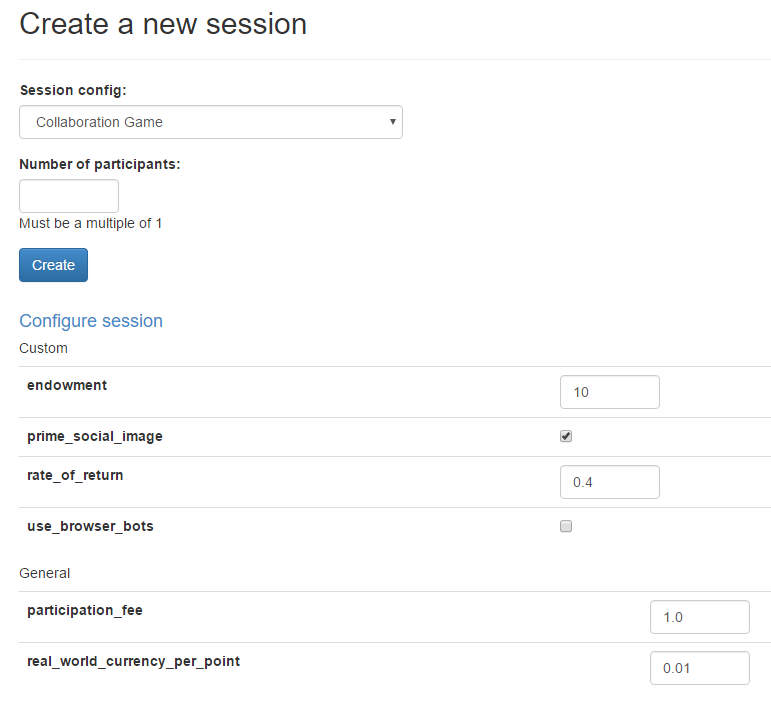

.. _treatments:

Treatments
==========

To assign participants to different treatment groups, you
can use :ref:`creating_session <creating_session>`.
For example, you can create a ``color`` field on the ``Player`` model:

.. code-block:: python

    class Player(BasePlayer):
        color = models.StringField()

And then randomly assign players to the "blue" or "red" treatment group:

.. code-block:: python

    class Subsession(BaseSubsession):

        def creating_session(self):
            # randomize to treatments
            for player in self.get_players():
                player.color = random.choice(['blue', 'red'])
                print('set player.color to', player.color)

You can also assign treatments at the group level (put the ``StringField``
in the ``Group`` class and change the above code to use
``get_groups()`` and ``group.color``).

Treatment groups & multiple rounds
----------------------------------

If your game has multiple rounds, a player could have different colors in different rounds,
because ``creating_session`` gets executed for each round independently.
To prevent this, set it on the participant, rather than the player:

.. code-block:: python

    class Subsession(BaseSubsession):

        def creating_session(self):
            if self.round_number == 1:
                for p in self.get_players():
                    p.participant.vars['color'] = random.choice(['blue', 'red'])

Then elsewhere in your code, you can access the participant's color with
``self.participant.vars['color']``.

For more on vars, see :ref:`vars`.

Balanced treatment groups
-------------------------

The above code makes a random drawing independently for each player,
so you may end up with an imbalance between "blue" and "red".
To solve this, you can use ``itertools.cycle``:

.. code-block:: python

    class Subsession(BaseSubsession):

        def creating_session(self):
            import itertools
            colors = itertools.cycle(['blue', 'red'])
            for p in self.get_players():
                p.color = next(colors)

.. _session_config_treatments:

Choosing which treatment to play
--------------------------------

In a live experiment, you often want to give a player a random treatment.
But when you are testing your game, it is often useful to choose explicitly which treatment to play.
Let's say you are developing the game from the above example and want to show your
colleagues both treatments (red and blue). You can create 2 session
configs that are the same,
except for ``color`` (in oTree Studio, add a "custom entry"):

.. code-block:: python

    SESSION_CONFIGS = [
        dict(
            name='my_game_blue',
            app_sequence=['my_game'],
            num_demo_participants=1,
            color='blue'
        ),
        dict(
            name='my_game_red',
            app_sequence=['my_game'],
            num_demo_participants=1,
            color='red'
        ),
    ]

Then in your code you can get the current session's color with ``self.session.config['color'].``

You can even combine this with the randomization approach. You can check
``if 'color' in self.session.config:``; if yes, then use that color; if no,
then choose it randomly.

.. _edit_config:

Configure sessions
------------------

You can make your session configurable,
so that you can adjust the game's parameters in the admin interface.

For example, let's say you have a "num_apples" parameter.
The usual approach would be to define it in ``Constants``,
e.g. ``Constants.num_apples``.
But to make it configurable, you can instead define it in your :ref:`session config <SESSION_CONFIGS>`.
For example:

.. code-block:: python

    dict(
        name='my_session_config',
        display_name='My Session Config',
        num_demo_participants=2,
        app_sequence=['my_app_1', 'my_app_2'],
        num_apples=10
    ),

When you create a session in the admin interface, there will be a text box to change this number.
You can also add help text with ``'doc'``:

.. code-block:: python

    dict(
        name='my_session_config',
        display_name='My Session Config',
        num_demo_participants=2,
        app_sequence=['my_app_1', 'my_app_2'],
        num_apples=10,
        doc="""
        Edit the 'num_apples' parameter to change the factor by which
        contributions to the group are multiplied.
        """
    ),

In your app's code, you can do ``self.session.config['num_apples']``.

Notes:

-   For a parameter to be configurable, its value must be a number, boolean, or string.
-   On the "Demo" section of the admin, sessions are not configurable.
    It's only available when creating a session in "Sessions" or "Rooms".

Advanced topics
---------------

Group treatments that persist across rounds
~~~~~~~~~~~~~~~~~~~~~~~~~~~~~~~~~~~~~~~~~~~

Groups do not have any ``vars`` field,
because groups can be re-shuffled across rounds.
You should instead store the variable on one of the participants in the group:

.. code-block:: python

    def creating_session(self):
        if self.round_number == 1:
            for g in self.get_groups():
                p1 = g.get_player_by_id(1)
                p1.participant.vars['group_color'] = random.choice(['blue', 'red'])

Then, when you need to access a group's color, you would look it up like this:

.. code-block:: python

    p1 = self.group.get_player_by_id(1)
    color = p1.participant.vars['group_color']
